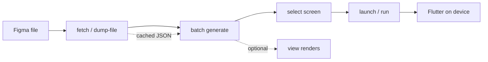
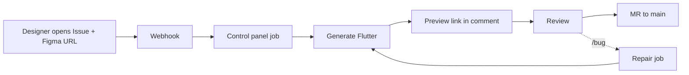

# Figma → Flutter Adaptive Layout Agent

[](https://github.com/paleophonix/figma-flutter-agent/actions/workflows/ci.yml)
[](LICENSE)
[](https://www.python.org/downloads/)
[](https://flutter.dev)
[](https://python-poetry.org/)
[](https://m3.material.io/)
[](https://github.com/astral-sh/ruff)
[](tests/)

**Turn Figma frames into production Flutter UI inside your existing app** — offline batch for multi-screen products, an interactive wizard for day-to-day dev, and an optional control plane for design–dev handoff (preview links, MRs).

Maintained by **[Celestial Agents](LICENSE)** · MIT · offline-first · Flutter-style CLI wizard

---

### Highlights

- **Figma frame → production Flutter** — screens, reusable widgets, theme, assets, routing into your existing app
- **Offline-first for real products** — download a whole file once; codegen 15+ screens without burning Figma quota
- **Flutter-style interactive wizard** — `figma-flutter` with no args: launch, fetch, generate, run, check, debug, view
- **LLM layout intent + deterministic compiler** — structured screen IR, validated emit, analyzer repair, optional pixel refine
- **Incremental sync** — regenerate only what changed; `// <custom-code>` zones survive updates
- **Team-ready control plane** — GitLab Issue workflow, Discord bot, REST + SSE jobs, web preview links, auto PR/MR
- **3700+ automated tests** — offline fixtures, corpus oracle, semantics gates, golden capture, optional live Figma smoke
- **Material 3 or Cupertino** — one config switch for iOS-style chrome and controls

---

## Table of contents

- [Overview](#overview)
- [Features](#features)
- [FAQ](#faq)
- [Requirements & setup](#requirements--setup)
- [Quick start](#quick-start)
- [Control panel](#control-panel-optional)
- [Documentation](#documentation)
- [License](#license)

---

## Overview

**Figma → Flutter Adaptive Layout Agent** turns Figma frames into Material 3 (or Cupertino) Flutter UI inside your existing app: screens, widgets, theme, assets, and optional routing — with an offline-first batch path for multi-screen products.

```text
Figma file  →  fetch / dump  →  parse & plan  →  codegen  →  flutter run
                  ↑ cached dumps under <agent_repo>/.debug/screen/ skip live API
```

**Typical journeys:**

| I want to… | Start here |
|------------|------------|
| See one screen in 30 seconds | Wizard **launch** (cached dump, no LLM) |
| Onboard a 15-screen Figma file | [Quick start](#quick-start) |
| Ship one frame from a fresh URL | `generate --figma-url …` |
| Let design open a GitLab Issue | [Control panel](#control-panel-optional) |
| Know what the wizard menus do | [Features §2](#2-interactive-wizard-figma-flutter--i) |
| Match a scenario to a workflow | [Features §15](#15-user-journeys-jtbd) |
| Understand LLM vs Figma costs | [FAQ](#faq) |

Agent context for coding assistants: [AGENTS.md](AGENTS.md), [CLAUDE.md](CLAUDE.md).

### How this differs from Figma export plugins

| | **Browser / IDE plugins** | **This agent** |
|---|---------------------------|----------------|
| **Output** | Snippets or a throwaway project | Idiomatic Flutter in **your** repo (`lib/`, `assets/`, theme) |
| **Multi-screen** | Usually one frame at a time | **One file dump** → batch codegen for all frames |
| **Iteration** | Re-export overwrites blindly | **Incremental sync** + `// <custom-code>` preservation |
| **Quality** | Best-effort Dart | `dart analyze`, repair loops, 3700+ tests, CI signoff |
| **Team workflow** | Manual copy-paste | GitLab Issue → **preview URL** → MR |
| **Offline** | Needs live Figma | Cached dumps; regen without API calls |

Plugins are great for spikes. This agent targets **ongoing products** where design changes every week.

### Flow: solo dev (local wizard)



### Flow: team (GitLab Issue)



---

## Features

End-to-end product map. The agent combines **LLM layout intent** (what goes where) with a **deterministic Flutter compiler** (how it is written) — you get adaptive UI in your repo, not one-off snippets. Engineering detail: [docs/](docs/).

### Deliverables (what lands in your Flutter project)

| Output | Description |
|--------|-------------|
| **Feature screens** | `lib/features/<slug>/<slug>_screen.dart` — one folder per Figma top-level frame |
| **Reusable widgets** | `lib/widgets/*.dart` — repeated clusters, extracted subtrees, shared components |
| **Theme system** | `app_colors.dart`, `app_spacing.dart`, `app_theme.dart`, optional dark theme |
| **Typography & layout tokens** | Radii, spacing, breakpoints (`app_layout.dart`) |
| **Assets** | SVG icons, PNG rasters (incl. blur fallbacks), optional WebP |
| **Fonts** | Google/custom font wiring + `pubspec` entries when enabled |
| **Routing** | Optional GoRouter / AutoRoute / Navigator 2.0 + prototype transitions |
| **State management stubs** | Optional Riverpod / BLoC / Provider scaffolding |
| **Navigation chrome** | Tabs, bottom nav, side rail on wide breakpoints |
| **Prototype flows** | Modal sheets, dialogs, scroll-to targets from Figma prototype links |
| **Golden tests** | Optional `test/golden/*_screen_test.dart` scaffolds |
| **Design tokens import** | `import-tokens` from Figma Variables (when API allows) |

Everything is written into an **existing** Flutter repo — the agent does not scaffold a greenfield app for you.

---

### Who it is for

| Persona | Typical workflow |
|---------|------------------|
| **Solo mobile dev** | Wizard **fetch → generate → launch**; iterate on one screen with cached dumps |
| **Team with 10–50 screens** | **batch dump-file** once → **batch generate** offline → **run** any screen |
| **Design–dev handoff** | Preflight (**check → screen-assets**), combat renders (**view → renders**), Issue-based regen |
| **Platform / release engineer** | `./scripts/signoff.sh`, corpus oracle, semantics gates, CI live Figma smoke |
| **Ops / internal tools** | Control panel: webhook → job → preview URL → MR to `main` |

---

### 1. Figma ingestion

Pull design truth from Figma REST API or from cached JSON on disk.

| Capability | User value |
|------------|------------|
| **Single frame URL** | Paste any `figma.com/design/...?node-id=` link — wizard or `generate` |
| **Full file dump** | One file API call + batched images for **all** screens and assets |
| **Offline dumps** | Work without network after first fetch; ideal for CI and air-gapped regen |
| **Scoped refresh** | Re-download JSON only, vectors only, rasters only, or skip existing files |
| **Frame import** | Add one screen to `screens.yaml` with merge or overwrite manifest |
| **screens.yaml manifest** | Stable slug ↔ node id map; drives batch generate, run, and wizard pickers |
| **Variables & styles** | Best-effort token fetch; paints + published styles fallback on 403 |
| **Prototype metadata** | Overlay destinations, transitions (DISSOLVE, SLIDE_IN, …) for routing emit |

**Quota-friendly pattern:** `batch dump-file` → `batch generate` → `run` — not repeated live `generate` per screen. See [FAQ — Figma API usage](#how-do-i-minimize-figma-api-usage).

---

### 2. Interactive wizard (`figma-flutter` / `-i`)

TTY menu when you run the CLI with no subcommand — same spirit as `flutter create` / `flutter run`.

**Default: launch** — fastest path to see something on device: cached dump + saved screen IR, **no new LLM call**, then `flutter run`.

| Menu | What you do here |
|------|------------------|
| **launch** | Quick preview: offline IR + device run (Chrome/mobile from config) |
| **switch** | Pick active app in a multi-app workspace (`FIGMA_FLUTTER_PROJECT_DIR`) |
| **check** | Health: fonts, assets on disk, doctor, live Figma, `flutter analyze` |
| **fetch** | Import one frame or whole file (`quick` = full rewrite; `advanced` = scope + skip-existing) |
| **list** | Manifest + preflight; rename slug; export missing assets; delete/copy screens |
| **select** | Set active screen → wires `main.dart` for run/launch |
| **generate** | **batch** all manifest screens, **one** frame, or **compare** 3 LLM models side by side |
| **run** | **ir-offline** (cache only), **full** (live sync + assets + run), **offline** (cache generate + run) |
| **debug** | OpenCode repair: new worktree, continue session, or run Flutter from repair bundle |
| **view** | **chrome** / **preview** PNG / **renders** (Figma vs Flutter heatmap) / combined review flows |

**check** submenu in detail:

| Item | Finds / fixes |
|------|----------------|
| **all** | Full preflight chain before a big generate |
| **all-fonts** / **screen-fonts** | Missing or mismatched fonts under `assets/fonts/` |
| **all-assets** / **screen-assets** | Icons/images on disk vs what the active screen dump expects; can export gaps |
| **doctor** | Token, Flutter SDK, AST sidecar binary, Docker golden image, OpenCode CLI |
| **live-check** | Smoke fetch against real Figma API |
| **analyze** | `flutter analyze` on the target project |

**list** submenu: **rename** slugs, **assets** export from cached dump, **delete** screen + purge lib/assets/debug, **copy** screens to another Flutter project.

Exit wizard with **Ctrl+C** (menu loops until interrupted).

---

### 3. Code generation pipeline

**Product mental model:** the LLM proposes a structured screen plan (IR); the compiler validates it and writes Material/Cupertino Dart. Analyzer repair fixes compile errors; optional visual refine closes pixel gaps.

| Stage | What happens |
|-------|----------------|
| **Parse** | Figma tree → clean geometry, classification (button, input, stack, scroll, …) |
| **LLM screen IR** | Model returns structured `screenIr` + `extractedWidgets[].widgetIr` (strict JSON schema) |
| **IR validation** | Stack bounds, nested scroll, ghost occlusion, tokens, on-disk assets — auto-fix or fail |
| **Deterministic emit** | Material/Cupertino widgets, flex/stack layout, theme tokens — no hand-written Dart from LLM |
| **Cluster widgets** | Repeated Figma patterns → single `lib/widgets/<name>.dart` |
| **Subtree widgets** | Vector-heavy icons/illustrations the LLM must not redraw inline |
| **Background layer** | Decorative root art → `Positioned.fill` behind centered canvas |
| **AST sidecar** | Post-emit Dart fixes (unscale, unwrap `LayoutBuilder`) without regex surgery |
| **Analyzer repair** | LLM patches materialized files when `dart analyze` fails (configurable attempts) |
| **Visual refine** | Optional pixel-diff loop: capture Flutter PNG → compare to Figma → surgical IR patches |

**Compare mode** (`generate → compare`): same dump, three models (`LLM_GENERATE_MODEL` ×3), IR snapshots only — pick a winner before full emit.

**Profiles:** production gates on by default for `generate`; `run` uses dev profile unless `--strict`; `--allow-dev-profile` for local iteration.

---

### 4. Layout & widgets

Compiler maps Figma Auto Layout, stacks, and semantic names to Flutter layout.

| Category | Supported emit |
|----------|----------------|
| **Flex** | `Row`, `Column`, `Wrap`, `Expanded` / `Flexible` |
| **Scroll** | `ListView` / `ListView.builder`, `GridView` / `GridView.builder`, nested scroll for BOTH overflow |
| **Stack** | `Stack` + `Positioned`, paint-order preservation |
| **Inputs** | `TextField`, `Checkbox`, `Switch`, `RadioListTile`, `DropdownButton`, `Slider` (+ Cupertino twins) |
| **Actions** | `ElevatedButton`, `OutlinedButton`, `TextButton`, `CupertinoButton` |
| **Surfaces** | `Card`, `AlertDialog` |
| **Carousel** | `PageView` (names: carousel / pager / swiper) |
| **Navigation** | `DefaultTabController`, `BottomNavigationBar`, `NavigationRail` on wide |
| **Variants** | Figma component properties → `enabled`, `obscureText`, button style, selection state |

Large lists (≥ 8 children) prefer builders where structure is provable. Heavy subtrees get `RepaintBoundary`.

---

### 5. Responsive & preview

| Feature | Behavior |
|---------|----------|
| **Breakpoints** | Mobile-small ≤480, mobile-large ≤768, tablet ≤1024; column→row reflow |
| **Max web width** | `max_web_width: 1200` — centered column on desktop |
| **Preview modes** | `static` (fixed artboard), `responsive` (adaptive), `both` (dual Chrome ports) |
| **Launch sizing** | Frame size from dump wins; YAML preview dimensions are fallback only |
| **Wide chrome** | Sidebar / rail navigation when layout tier demands it |

Wizard **view** and **launch** respect `runtime.flutter_device_id` (default: auto → Chrome when available).

---

### 6. Assets & fonts

| Feature | Behavior |
|---------|----------|
| **SVG icons** | Exported via Figma Images API; referenced in generated `flutter_svg` code |
| **PNG rasters** | Fills, photos, blur-layer fallbacks when vectors are insufficient |
| **Multi-scale PNG** | `@2x` / `@3x` when configured |
| **On-demand export** | Wizard **list → assets** or **check → screen-assets** fills gaps without full re-dump |
| **Font audit** | Wizard flags design fonts missing from `assets/fonts/` |
| **Font download** | Optional fetch + `pubspec` wiring (`fonts.download_fonts`) |
| **WebP** | Opt-in (`assets.webp`); requires Pillow |

**Fidelity tiers (conceptual):** declarative flex/stack (default) → SVG paths for simple vectors → PNG/raster for complex art → unsupported layers surface in design-coverage report.

---

### 7. Incremental sync & developer preservation

| Feature | Behavior |
|---------|----------|
| **Region-aware hashes** | Repeated cluster edits rewrite only `lib/widgets/<widget>.dart` |
| **Layout changes** | Non-cluster diffs rewrite the screen layout file |
| **Skip unchanged tree** | Same design hash → skip LLM regen (theme-only pass still runs) |
| **Token-only Figma change** | `regen_llm_on_token_change` triggers IR refresh without full tree churn |
| **Custom zones** | Edits inside `// <custom-code>` … `// </custom-code>` survive regeneration |
| **Strict preservation** | Production profile can **refuse** to write if you edited outside zones |
| **Per-screen snapshot** | `.debug/screen/<project>/<feature>/snapshot.json` tracks what changed |
| **Force regen** | `--force-llm-regen` after prompt/model swaps |

---

### 8. Visual review & golden capture

| Feature | Behavior |
|---------|----------|
| **Figma reference PNG** | `figma.png` + metadata beside debug bundle |
| **Flutter capture** | Warm sandbox `flutter test` capture (Docker or host) |
| **Combat renders** | Side-by-side Figma ref, Flutter PNG, diff heatmap under `renders/<session>/` |
| **Wizard view** | chrome-only, PNG-only, renders-only, or full-review combos |
| **Golden tests** | Optional scaffold comparing Flutter render to committed baseline |
| **Visual refine loop** | Optional LLM patches driven by pixel diff (off by default) |
| **Typography specimen** | Optional font/glyph golden for text-heavy screens |

Golden capture runtime: `auto` \| `docker` \| `host` — see [docs/reference/26-07-01-engineering-reference/development.md](docs/reference/26-07-01-engineering-reference/development.md).

---

### 9. AI repair & debug agent

When codegen or analyze fails, wizard **debug** spins an OpenCode repair session:

| Mode | Use when |
|------|----------|
| **new** | Fresh repair worktree from `.debug` triage bundle |
| **continue** | Resume stalled repair on existing worktree |
| **run** | Launch Flutter from repaired debug bundle |

Requires `opencode` CLI (`bootstrap.ps1` can install). Headless repair also available via control panel ARQ jobs when `repair.enabled`.

Diagnose/repair skills for coding agents: `.cursor/skills/diagnose/`, `.cursor/skills/repair/` — read `.debug` artifacts, fix compiler laws, not one-off screen patches.

---

### 10. Quality, semantics & CI gates

Offline release gate (`./scripts/signoff.sh`) bundles:

| Gate | Protects against |
|------|------------------|
| **demo-signoff** | Five fixture screens failing §23 acceptance + `dart analyze` |
| **fixture-ir-validate** | Drift in cached screen IR snapshots |
| **fidelity validate** | Broken fidelity manifest entries |
| **corpus-oracle gate** | Regressions across fixture corpus pixel/geometry profiles |
| **semantics corpus-gate** | Wrong BUTTON/INPUT/… classification precision/recall |
| **fixture-geometry-check** | Parse-tree geometry invariant violations |
| **3700+ pytest** | Parser, emitter, batch, sync, layout law regressions |

**Semantics (report-only by default):** classifies nodes as buttons, inputs, chips, etc.; writes `semantics.json` for triage without silently changing emit until gates allow.

**AI UX report:** heuristic a11y/spacing/nesting suggestions in `ai_ux.json` + pipeline warnings.

**Accessibility:** optional `accessibility.auto_fix` bumps small fonts and low contrast before emit; production can fail instead of auto-fixing.

---

### 11. Control panel & team workflows (optional)

Install: `poetry install --with dev,control_panel`. See [Control panel](#control-panel-optional).

| Channel | Workflow |
|---------|----------|
| **GitLab Issues** | Issue description = Figma URL → agent generates → preview link in comment → MR on close |
| **Issue commands** | `/bug …` repair, `/regen` cold regen (in issue notes) |
| **Discord** | `/generate` with same codegen config as local wizard |
| **REST API** | `POST /v1/jobs`, poll or SSE `GET /v1/jobs/{id}/events` |
| **Web preview** | `GET /preview/{job_id}?token=&mode=` — live `flutter run` or static release build |
| **CLI publish** | `generate --pr --repo-key … --publish-mode new\|existing` → GitHub/GitLab PR/MR |
| **Feedback jobs** | User comment → LLM ticket text + artifact bundle zip |

Multi-repo mapping via `.control-panel.yml` (`projects.repos`, GitLab `app_project_id`, artifact remote).

---

### 12. Multi-app workspace

| Feature | Behavior |
|---------|------------|
| **FIGMA_FLUTTER_PROJECT_DIR** | Parent folder with `demo_app/`, `limbo/`, … |
| **wizard switch** | Pick active app; persisted in `workspace-state.yml` |
| **wizard-state.yml** | Active screen slug per Flutter project |
| **screens.yaml per app** | Independent batch manifests |
| **Agent-owned debug** | All screen artifacts under agent repo `.debug/screen/<project>/` |

One agent install can serve many Flutter apps in a monorepo-style workspace.

---

### 13. Configuration surfaces (no code changes)

| File | Controls |
|------|----------|
| **`.env`** | Figma token, LLM provider/models/keys, golden runtime overrides |
| **`.ai-figma-flutter.yml`** | Theme variant, responsive mode, repair/refine loops, gates, assets, routing, sync |
| **`.control-panel.yml`** | Discord/GitLab, preview ports, publish strategy, repair jobs |
| **`wizard-state.yml`** | Active screen (per Flutter app) |
| **`screens.yaml`** | Batch screen list (per Flutter app) |

LLM provider and model names live in **`.env` only** — not in YAML — so secrets and model swaps stay out of git.

---

### 14. Product boundaries (honest MVP)

Not promised in the default `generate` path:

| Area | Status |
|------|--------|
| **Pixel-perfect without iteration** | Compile-time fidelity is the goal; mandatory pixel-refine loops are optional dev tools |
| **Editable text 1:1 with Figma** | True typographic identity needs rasterization (accessibility trade-off) |
| **Figma Dev Mode API** | Styles synthesized from REST; optional plugin CSS dump for gaps |
| **Lottie / micro-animations** | Prototype navigation transitions only |
| **Logic / variables / conditions** | Planned epics — not production codegen today |
| **Auto-commit from Figma webhooks** | Control panel publishes MRs; local wizard does not |
| **Greenfield `flutter create`** | You bring the Flutter project; agent fills `lib/` |

See [docs/reference/26-07-01-engineering-reference/technical-notes.md](docs/reference/26-07-01-engineering-reference/technical-notes.md) for engineering detail and MVP deltas.

---

### 15. User journeys (JTBD)

| When I want to… | I use… | Success looks like |
|-----------------|--------|-------------------|
| **See the last generated screen on my phone in under a minute** | Wizard **launch** | `flutter run` with cached IR — no LLM wait, no Figma call |
| **Import a new 20-screen Figma file without killing API quota** | **fetch → quick** then **generate → batch** | `screens.yaml` + assets + offline codegen for all frames |
| **Check that icons from the design actually landed in the repo** | **check → screen-assets** or **list → assets** | Preflight lists gaps; export fills missing SVG/PNG |
| **Hand a screen to QA with a visual diff** | **view → renders** | Figma PNG, Flutter PNG, heatmap in `renders/<session>/` |
| **Regenerate after a Figma tweak without losing my `onPressed` hack** | `generate` with sync + `// <custom-code>` zones | Only touched widgets/layout files change; custom block intact |
| **Pick which of three LLM models layouts better** | **generate → compare** | Three IR snapshots (`ir_1.json` … `ir_3.json`) before Dart write |
| **Fix analyze failures without hand-editing generated layout** | **debug → new/continue** | OpenCode repair worktree from `.debug` bundle |
| **Let design request a screen via ticket, not Slack** | GitLab Issue + control panel | Preview URL in issue comment; MR on close |
| **Ship a hotfix layout from CI, not a laptop** | `generate --pr` or Issue workflow | PR/MR with production gates from signoff profile |
| **Run the same gates as CI before merge** | `./scripts/signoff.ps1` | ruff, mypy, fixtures, oracle, semantics, pytest green |

Menu reference: [Features §2](#2-interactive-wizard-figma-flutter--i).

---

## FAQ

### Why is an LLM required?

Live `generate` asks a model for **layout intent** (structured screen IR), not raw Dart. A deterministic compiler then emits Flutter widgets, enforces analyze gates, and can repair failures. Cached dumps and wizard **launch** can skip a **new** LLM call when IR is already on disk; batch regen after the first pass still needs keys unless you reuse cached IR.

### How do I minimize Figma API usage?

| Pattern | Figma calls |
|---------|-------------|
| `batch dump-file` once per file | 1× file + batched images |
| `batch generate` on cached dumps | **0** |
| Wizard **launch** / **run → ir-offline** | **0** |
| `batch dump` per screen | 1× per screen (avoid for large files) |
| Repeated live `generate` per frame | 1×+ per run — expensive |

Use **fetch → advanced → skip existing** when refreshing assets without rewriting JSON.

### What drives LLM cost?

- **Per screen:** one generate call (plus optional repair attempts after `dart analyze`, and optional visual refine loops).
- **Compare mode:** three IR calls, one Dart emit — useful for model selection, not daily iteration.
- **Mitigation:** batch offline regen, skip unchanged trees (sync), wizard **launch** for preview without regen.

Tune models via `.env` (`LLM_GENERATE_MODEL`, `LLM_REPAIR_MODEL`). Provider: `anthropic`, `openai`, `openrouter`, `google`, `google_aistudio`.

### Can I preview without regenerating?

Yes. Wizard **launch** uses cached dump + saved screen IR and runs `flutter run` — no Figma fetch, no new LLM call. Use after **select** to wire `main.dart` to the screen you care about.

### Where does generated code live?

In your Flutter project: `lib/features/`, `lib/widgets/`, `lib/theme/`, `assets/`. Debug/triage artifacts live in the **agent repo** under `.debug/screen/<project>/<feature>/` (not in the app repo).

### What should I design in Figma for best results?

- **Auto Layout** on frames and lists  
- **Named components** and variants (`Type`, `State`, `Size`)  
- **Consistent slugs** — frame names become feature folders  
- **SVG-friendly icons** where possible  
- **Prototype links** for overlays and navigation hints  

### Is pixel-perfect guaranteed?

Compile-time fidelity is the goal; optional visual refine can close gaps. Editable text rarely matches Figma typography 1:1 without rasterization. See [Features §14](#14-product-boundaries-honest-mvp).

---

## Requirements & setup

- Python 3.11+
- [Poetry](https://python-poetry.org/) (recommended) or [uv](https://github.com/astral-sh/uv)
- Flutter SDK 3.44+ (for running and validating generated apps)
- Figma Personal Access Token
- Anthropic / OpenAI / OpenRouter / Google (AI Studio) API key (required for normal `generate` / batch workflows)

```bash
poetry install --with dev
copy .env.example .env
# optional one-shot dev bootstrap (deps, opencode-ai, AST sidecar, golden image):
.\scripts\bootstrap.ps1
```

Copy agent config once in this repo:

```bash
copy .ai-figma-flutter.yml.example .ai-figma-flutter.yml
```

Edit `.ai-figma-flutter.yml` here (codegen gates, LLM repair/refine, visual QA). It is **not** stored in the Flutter project.

The shipped config uses LLM screen IR by default:

```yaml
generation:
  use_screen_ir: true
  require_screen_ir: true
```

Set in `.env`:

```env
FIGMA_ACCESS_TOKEN=figd_...
FIGMA_FLUTTER_PROJECT_DIR=E:/@dev
ANTHROPIC_API_KEY=sk-ant-...
LLM_PROVIDER=anthropic
LLM_GENERATE_MODEL=
```

`LLM_PROVIDER` supports `anthropic`, `openai`, `openrouter`, `google`, and `google_aistudio` (AI Studio → `GOOGLE_API_KEY`). See `.env.example` for repair/refine models, reasoning knobs, and golden-capture overrides.

`FIGMA_FLUTTER_PROJECT_DIR` is optional: workspace root (parent of Flutter apps) when `--project-dir` is omitted. Use wizard **switch** to pick the active app; choice is stored in `<workspace>/.figma-flutter/workspace-state.yml`. Active screen slug lives in `<project_dir>/wizard-state.yml`. Falls back to sibling `../demo_app`, then cwd. Not stored in YAML — agent `.env` only.

Create a Flutter project separately:

```bash
flutter create demo_app
```

Design frames in Figma with Auto Layout, named components, and SVG export settings for icons.

> **Note:** Throughout this document, `poetry run figma-flutter` is used. With uv, replace it with `uv run figma-flutter`.


---

## Quick start

Interactive wizard: `poetry run figma-flutter` (or `Ctrl+Shift+B` / `F5` in VS Code). Menu map: [Features §2](#2-interactive-wizard-figma-flutter--i).

### Multi-screen (offline-first)

```bash
# 1. Download whole Figma file once
poetry run figma-flutter batch dump-file \
  --project-dir ../demo_app \
  --figma-url "https://www.figma.com/design/FILE_KEY/Name"

# 2. Codegen all screens offline (no Figma API)
poetry run figma-flutter batch generate --manifest ../demo_app/screens.yaml

# 3. Preview one screen
poetry run figma-flutter run sign_in --project-dir ../demo_app
```

### Single frame (live)

```bash
poetry run figma-flutter generate \
  --figma-url "https://www.figma.com/design/FILE_KEY/Name?node-id=1-2" \
  --project-dir ../demo_app
```

Add `--dry-run` to plan without writes. Add `--allow-dev-profile` for soft gates locally.

### IDE shortcuts

| Action | How |
|--------|-----|
| Wizard menu | `poetry run figma-flutter -i` or status bar **▶ figma-flutter** |
| Default build | `Ctrl+Shift+B` → same menu |
| Doctor | `poetry run figma-flutter doctor` |

---

## Control panel (optional)

Headless jobs for teams: design opens a ticket, agent generates code, stakeholder gets a preview link, MR lands on `main`. Full capability table: [Features §11](#11-control-panel--team-workflows-optional).

| Capability | Detail |
|------------|--------|
| **GitLab Issue-first** | Webhook → job → preview URL → MR on close |
| **Issue commands** | `/bug …`, `/regen` in issue notes |
| **Discord** | `/generate` with same config as local wizard |
| **REST + SSE** | `POST /v1/jobs`, `GET /v1/jobs/{id}/events` |
| **Web preview** | Tokenized URL; live or static release build |
| **CLI publish** | `generate --pr --repo-key …` |

```bash
poetry install --with dev,control_panel
copy .control-panel.yml.example .control-panel.yml
docker compose -f docker-compose.local.yml --profile bundled-db up
poetry run alembic upgrade head
poetry run figma-flutter-control-panel
poetry run figma-flutter-worker
```

Details: [src/control_panel/README.md](src/control_panel/README.md).

---

## Documentation

| Doc | For |
|-----|-----|
| [docs/reference/26-07-01-engineering-reference/cli.md](docs/reference/26-07-01-engineering-reference/cli.md) | All CLI commands, batch scopes, flags |
| [docs/reference/26-07-01-engineering-reference/debug-artifacts.md](docs/reference/26-07-01-engineering-reference/debug-artifacts.md) | `.debug/screen/` triage |
| [docs/reference/26-07-01-engineering-reference/development.md](docs/reference/26-07-01-engineering-reference/development.md) | Tests, signoff, widgets, CI smoke |
| [docs/reference/26-07-01-engineering-reference/technical-notes.md](docs/reference/26-07-01-engineering-reference/technical-notes.md) | Limitations, sync, spec interpretation |
| [AGENTS.md](AGENTS.md) | Coding assistant context |
| [scripts/README.md](scripts/README.md) | Release gates |
| [docs/README.md](docs/README.md) | Full docs index (incl. localized overviews) |

---

## License

Copyright © 2026 [Celestial Agents](LICENSE).

This project is licensed under the **MIT License** — see the [LICENSE](LICENSE) file for details.
