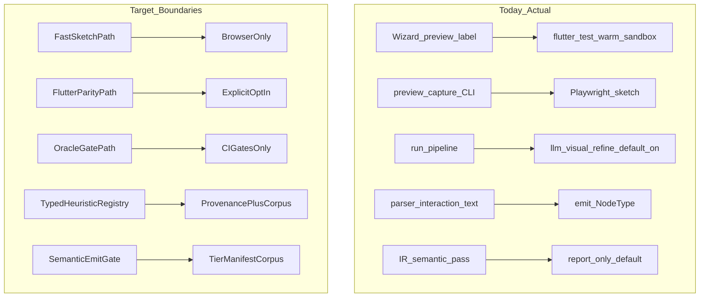

# Architectural boundaries — target state map

## Current vs target boundaries

## Boundary inventory

| Boundary | Today | Should live | Missing invariant |
| --- | --- | --- | --- |
| **Fast sketch vs Flutter parity** | Split in `preview_capture/router.py` but **not** used by wizard/debug capture | CLI/product layer | Single `CaptureBackend` enum routed everywhere |
| **Preview vs oracle artifact** | Only post-capture filename/diff differ | `preview_capture` package | Preview must not invoke `capture_planned_in_warm_sandbox` without opt-in |
| **Interactive vs CI validation** | `llm_visual_refine` on by default in generate/wizard | `config/profiles.py` | `apply_interactive_preview_profile` must disable refine + oracle |
| **Parse facts vs semantic guesses** | Name/text → `NodeType` in parser | `parser/interaction` + provenance | `derived_from_name` marker; emit reads geometry tier only |
| **IR semantic vs emit semantic** | IR pass report-only; emit uses tree `NodeType` | `fidelity router` + `emit/dispatch` | `semantic native emit` gate from project bible |
| **Deterministic vs LLM repair** | Repair loop after analyze for syntax + geometry | `stages/llm_repair` | Fail-closed when IR/graph invariant broken |
| **Compiler vs corpus oracle** | Oracle separate from generate (good) | `validation/oracle` | Document that generate green ≠ pixel proof |
| **Reconcile vs emit** | 14 passes mutate tree; synthetic node names | `normalize.py` | Pass registry + mutual-exclusion tests per pass |

## Recommended mode split (product)

| Mode | User intent | Pipeline config | Capture |
| --- | --- | --- | --- |
| `sketch` | Layout sanity in seconds | No LLM refine, no analyze repair loop | Browser `preview-capture` |
| `iterate` | Edit codegen, hot reload | LLM on, refine off, repair on analyze fail | Optional `flutter run` |
| `parity` | Chrome-parity PNG | Emit + warm sandbox | `flutter test` capture |
| `oracle` | CI / signoff | Production profile | corpus-oracle + geometry |

## Layer responsibility map

| Layer | Owns | Must not own |
| --- | --- | --- |
| `parser/tree.py` | CP0 facts, dedup | Screen-specific emit choices |
| `parser/interaction/*` | Candidate signals (scored) | Final `NodeType` without gate |
| `generator/normalize.py` | CP1 geometry reconciliation | Synthetic names consumed by emit |
| `generator/ir/validate` | Fail-closed render safety | Pixel diff |
| `generator/layout/emit` | Widget archetypes | Text/password heuristics |
| `preview_capture/router` | Mode dispatch | Pipeline orchestration |
| `validation/oracle` | Corpus pixel/geometry | Interactive preview |
| `config/profiles` | Mode bundles | Hidden per-call overrides |

## Missing gates (prioritized)

1. **P0** — Product capture router: wizard/debug must call `capture_with_mode`, not duplicate warm-sandbox paths.
2. **P0** — Interactive profile must turn off `llm_visual_refine` by default.
3. **P1** — Predicate registry CI: `audit predicate-matrix` fails on new overlap without test (already proposed in remediation-backlog).
4. **P1** — Emit gate: no `node.name == "ConsentRow"` branches; use typed `layout_role` from reconcile with provenance.
5. **P2** — Map all 52 `SYSTEMIC_BUG_RULES` to sanitizer or IR guard; burn down prompt-only.

## Files to touch in a remediation epic (not this review)

- [`src/figma_flutter_agent/dev/view_renders.py`](../../src/figma_flutter_agent/dev/view_renders.py)
- [`src/figma_flutter_agent/debug/capture.py`](../../src/figma_flutter_agent/debug/capture.py)
- [`src/figma_flutter_agent/config/profiles.py`](../../src/figma_flutter_agent/config/profiles.py)
- [`src/figma_flutter_agent/parser/interaction/shared.py`](../../src/figma_flutter_agent/parser/interaction/shared.py)
- [`src/figma_flutter_agent/generator/layout/widgets/emit/dispatch.py`](../../src/figma_flutter_agent/generator/layout/widgets/emit/dispatch.py)
