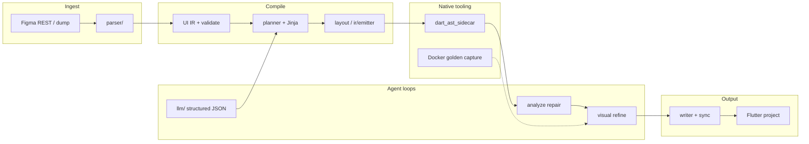

# Оценка проекта: Figma → Flutter Agent

*Дата оценки: 8 июня 2026. Метрики получены прямым подсчётом по репозиторию; тесты — `poetry run pytest --collect-only`.*

Документ дополняет [ASSESSMENT.md](ASSESSMENT.md) (записка к тестовому заданию) и даёт **внешнюю калибровку**: уровень зрелости, сложность, трудозатраты, профиль команды и порядок стоимости разработки «с нуля».

---

## 1. Краткий вывод

| Критерий | Оценка |
|---|---|
| **Общий уровень** | Продвинутый прототип / **pre-production** с сильной инженерной обвязкой |
| **Класс задачи** | Компилятор дизайна → код (R&D, верхний дециль сложности в dev-tools) |
| **Архитектура** | Высокая: многослойный пайплайн, IR, геометрия, нативный AST, LLM-петли |
| **Стек** | Высокая: Python + Flutter/Dart + LLM-провайдеры + Docker + CI |
| **Эквивалент трудозатрат** | **24–36 человеко-месяцев** классической разработки |
| **Квалификация** | Senior/Staff: компиляторы, Flutter, computational geometry, LLM systems |
| **Стоимость «с нуля» (оценка)** | **$400k–$1.2M** (США/Западная Европа) · **$150k–$400k** (Восточная Европа) |

Проект **значительно превышает** объём типичного MVP или middle-тестового задания. По охвату функций ближе к **продуктовому роадмапу команды 4–6 человек на 6–12 месяцев**, чем к одному репозиторию «на выходные».

---

## 2. Масштаб кодовой базы (верифицируемые метрики)

| Слой | Строк кода | Файлов | Назначение |
|---|---:|---:|---|
| Production Python (`src/`) | **~76 900** | 253 | Парсер, генератор, LLM, пайплайн, валидация |
| Автотесты (`tests/`) | **~46 100** | 352 | Unit, интеграция, golden, acceptance |
| Dart AST sidecar (`tools/dart_ast_sidecar/`) | **~3 920** | 18 | Семантические мутации Dart через Analyzer |
| Jinja-шаблоны | **~1 720** | 27 | Детерминированная кодогенерация |
| Документация (`docs/`) | **~10 100** | 44 | Спеки, аудиты, runbook'и |
| **Итого (без generated Flutter)** | **~138 700** | **694+** | |

**Тесты:** ~**1 949** тест-кейсов собрано pytest (2 ошибки коллекции в `test_process_run_validation.py` — не влияют на порядок величины).

**Соотношение тесты : production-код** ≈ **0,6 : 1** по строкам — выше среднего для индустрии и характерно для compiler-grade проектов.

### Распределение Python по пакетам

| Пакет | Строк | Файлов | Роль |
|---|---:|---:|---|
| `generator/` | 34 002 | 74 | IR, layout engine, planner, emit, postprocess |
| `parser/` | 8 681 | 32 | Figma tree, геометрия, токены, классификация |
| `llm/` | 5 390 | 17 | Structured output, prompts, repair/refine |
| `validation/` | 3 975 | 14 | Golden capture, spec §23, visual QA |
| `stages/` | 3 051 | 14 | Стадии пайплайна (LLM, write, assets, refine) |
| `pipeline/` | 2 197 | 11 | Оркестрация end-to-end |
| Остальное | ~19 600 | 91 | CLI, batch, sync, fonts, figma API, observability |

Ядро сложности — **`generator` + `parser`** (~56% production-кода).

---

## 3. Общий уровень зрелости

### 3.1. Шкала

```
Идея → PoC → MVP → Pre-production → Production → Enterprise
                         ▲
                    проект здесь
```

### 3.2. Что уже на уровне pre-production

- **Полный пайплайн** Figma REST → parse → plan → codegen → `flutter analyze` → write → incremental sync.
- **Два режима генерации:** детерминированный layout engine (offline CI) и LLM screen IR (основной продуктовый путь).
- **Многоступенчатые LLM-петли:** generate → analyze repair → visual refine (pixel diff / IoU).
- **Нативный AST-слой** на Dart Analyzer — не regex-постобработка.
- **CI:** ruff, mypy (strict на критичных модулях), offline sign-off, visual QA profile, optional live Figma smoke.
- **Observability:** PostHog `$ai_generation`, корреляция по `run_id`, структурные логи стадий.
- **Инкрементальная синхронизация** с preservation zones (`// <auto-generated>`, `// <custom-code>`).
- **Покрытие спецификации:** 25 разделов ТЗ — практически все имеют модуль (см. [ASSESSMENT.md §5](ASSESSMENT.md)).

### 3.3. Что удерживает от production / enterprise

| Область | Статус | Источник |
|---|---|---|
| Multi-breakpoint responsive | Каркас есть, pixel-fidelity мобильного фрейма — приоритет | `docs/limitations.md`, `generator/layout/responsive.py` |
| Figma Variables / conditional logic | Post-MVP, IR «слеп» к bindings | `docs/limitations.md`, `enterprise-readiness-tz.md` |
| Widget chunking для oversized-деревьев | Wired-but-broken / частично | `enterprise-readiness-tz.md` MINE-1 |
| Perf на enterprise-деревьях (глубина >10) | Не профилировалось, нет perf-gate | `enterprise-readiness-tz.md` V2 |
| Геометрический слой (аффинный каскад) | Активная доводка | `docs/projects/core-audit/` |

**Итог:** продукт **работоспособен и эксплуатируем** для целевого сценария (batch offline, мобильные экраны, controlled corpus). Для контракта «10 000 произвольных экранов enterprise» нужен отдельный hardening-эпик (оценка: **+6–12 чел.-мес.**).

---

## 4. Сложность архитектуры

### 4.1. Модель системы

Проект — не «обёртка над API», а **транслятор (компилятор)** с жёстким IR-контрактом между стадиями:



### 4.2. Факторы высокой сложности

| Фактор | Почему это сложно |
|---|---|
| **Двойная семантика** | Figma layout (Auto Layout, constraints, variants) ≠ Flutter constraints (Flex, Stack, scroll) |
| **Вычислительная геометрия** | Аффинные каскады, z-order, overlap sweep, render boundaries |
| **Недетерминизм LLM** | Structured output + repair + registry системных багов + idempotent sanitizers |
| **Кросс-языковой toolchain** | Python orchestrator + Dart AST compiler + Flutter SDK validation |
| **Fidelity tiers** | Declarative → SVG → raster → visual refine (compile-time + optional measurement) |
| **Инкрементальность** | Region-aware hashes, custom-code preservation, corrupt snapshot handling |

### 4.3. Архитектурная зрелость (плюсы)

- **Dependency injection** в пайплайне (`PipelineDependencies`) — тестируемость без monkeypatch.
- **Pydantic-схемы** на границах (settings, IR, API payloads).
- **Anti-patching law** — явный запрет screen-specific костылей в compiler core.
- **Разделение стадий** (`stages/`) с observability hooks.

### 4.4. Архитектурный долг (минусы)

- In-place мутации дерева в отдельных parser-проходах (иммутабельность не везде).
- Size-gate 80KB → silent skip AST на самых сложных файлах.
- Perf и chunking не закрыты для enterprise-scale.

**Оценка сложности архитектуры: 8,5 / 10** (сопоставимо с внутренними codegen-платформами крупных продуктовых компаний, не с типичным CRUD-backend).

---

## 5. Сложность технологического стека

### 5.1. Основной стек

| Категория | Технологии |
|---|---|
| **Языки** | Python 3.11+, Dart 3.x |
| **CLI / UX** | Typer, Rich, interactive wizard |
| **Конфигурация** | Pydantic Settings, ruamel-yaml |
| **Шаблоны** | Jinja2 |
| **HTTP / API** | httpx, Figma REST |
| **LLM** | Anthropic, OpenAI (strict JSON), Google, OpenRouter |
| **Качество кода** | Ruff, Black-style format, mypy (partial strict) |
| **Тесты** | pytest, pytest-asyncio, respx, offline fixtures |
| **Мобильный target** | Flutter 3.44+, Material 3, Cupertino |
| **Нативный компилятор** | Dart Analyzer (ast_sidecar), prebuilt binaries |
| **Инфра** | Docker (golden capture), GitHub Actions |
| **Observability** | Loguru, PostHog LLM tracing |

### 5.2. Порог входа для разработчика

Один разработчик **не может** эффективно сопровождать все слои. Минимум нужны компетенции в **трёх доменах одновременно**:

1. **Compiler / transpiler thinking** (IR, invariant validation, idempotent transforms).
2. **Flutter layout model** (constraints, scroll, theme, analyzer errors).
3. **LLM engineering** (structured output, cost control, repair loops).

Дополнительно: computational geometry, Docker/CI, Figma API — **желательно в команде**, не обязательно у каждого.

**Оценка сложности стека: 8 / 10.**

---

## 6. Оценка трудозатрат

### 6.1. Метод

Эквивалент «классической» разработки без AI-оркестрации, исходя из:

- объёма и плотности кода (~77k LOC production + ~4k Dart + инфра);
- домена (design-to-code compiler, не CRUD);
- тестового контура (~1 950 тестов, golden, integration);
- документации и CI.

Ориентиры индустрии для design-to-code / codegen tools: **12–36 чел.-мес.** (MVP) → **36–72+ чел.-мес.** (production hardening).

### 6.2. Декомпозиция по подсистемам

| Подсистема | Чел.-мес. (оценка) | Комментарий |
|---|---:|---|
| Figma connector + batch/offline | 2–3 | REST, dump, manifest |
| Parser + geometry | 6–9 | 32 файла, affine, z-order, classification |
| Design tokens + theme + assets | 3–4 | Fonts cascade, SVG/PNG/WebP |
| Deterministic layout engine | 8–12 | Крупнейший пакет, 74 файла |
| IR schema + emitter + validate | 4–6 | Screen IR path |
| LLM integration (generate/repair/refine) | 4–6 | Multi-provider, prompts, structured output |
| Dart AST sidecar | 3–4 | Отдельный язык и toolchain |
| Sync + writer + preservation | 2–3 | Transactional write, regions |
| Validation + golden + visual QA | 4–5 | Docker image, pixel diff |
| CLI + interactive UX + batch | 2–3 | |
| CI/CD + observability + docs | 3–4 | |
| Тесты (параллельно всем слоям) | 8–12 | ~46k строк тестов |
| **Итого** | **49–71** | С учётом параллелизма команды |

С учётом параллельной работы команды 4–5 человек и итераций/переоткрытий:

| Сценарий | Календарь | Эффективные чел.-мес. |
|---|---|---|
| **Консервативный** (команда 4, production-quality) | 12–15 мес. | **~36** |
| **Базовый** (команда 5–6) | 8–12 мес. | **~28** |
| **Оптимистичный** (сильная команда + reuse) | 6–8 мес. | **~24** |
| **AI-orchestrated** (1–2 senior + агент) | 3–6 мес. календаря | **~8–15** эквивалент* |

\* Эквивалент — пересчёт объёма в человеко-часы архитектора/оркестратора; не означает, что продукт «стоит 2 человеко-месяца» в смысле рыночной цены — см. §7.

### 6.3. Доработка до enterprise (сверх текущего состояния)

| Эпик | Чел.-мес. |
|---|---:|
| IR widget chunking (MINE-1) | 2–3 |
| Variables + conditional logic (MINE-2) | 4–6 |
| Perf gates + enterprise corpus | 2–3 |
| Multi-breakpoint responsive hardening | 3–5 |
| **Дополнительно** | **11–17** |

---

## 7. Квалификация разработчиков

### 7.1. Роли и уровень

| Роль | Уровень | Ключевые навыки |
|---|---|---|
| **Tech lead / architect** | Staff / Principal | Compiler pipelines, system design, Flutter + Python |
| **Compiler / layout engineer** | Senior+ (5+ лет) | IR, constraints, computational geometry |
| **Flutter engineer** | Senior (4+ лет) | Layout model, analyzer, golden tests |
| **LLM / AI engineer** | Senior (3+ лет) | Structured output, eval harnesses, cost/latency |
| **QA / tooling** | Middle–Senior | pytest, Docker, CI gates, fixture corpora |
| **DevOps (part-time)** | Middle+ | GitHub Actions, Docker golden image |

### 7.2. Минимальная жизнеспособная команда

| Конфигурация | Состав | Для чего |
|---|---|---|
| **Сопровождение** | 1 Staff + 1 Senior Flutter | Bugfix, corpus expansion |
| **Активная разработка** | 1 Staff + 2 Senior + 1 QA | Новые фичи + hardening |
| **Enterprise push** | +1 Senior compiler + 0.5 DevOps | Chunking, perf, SLA |

**Middle-разработчик без менторства** не сможет безопасно менять ядро (`generator/geometry`, `parser/`, `ir/`). Допустимы задачи на CLI, fixtures, документацию, изолированные виджеты.

### 7.3. Профиль «AI orchestrator» (как в текущем методе разработки)

Требуется **не junior prompt engineer**, а инженер с опытом:

- проектирования инвариантов и acceptance gates;
- чтения и ревью compiler-grade кода на Python и Dart;
- построения тестовых корпусов для недетерминированных моделей.

Это соответствует уровню **Senior / Staff AI Engineer**, а не «вайб-кодер без дисциплины».

---

## 8. Оценка стоимости разработки

*Все суммы — порядок величины, 2026, без учёта LLM API и Figma quota в runtime.*

### 8.1. Ставки (fully loaded)

| Регион | Senior ($/час) | Staff ($/час) | Blended team ($/час)* |
|---|---:|---:|---:|
| США / Западная Европа | 120–180 | 160–220 | **130–170** |
| Восточная Европа | 45–80 | 70–110 | **55–85** |
| Латинская Америка | 40–70 | 60–95 | **50–75** |

\* Blended — средневзвешенная ставка команды 4–5 человек (3 Senior + 1 Staff + 0.5 QA).

### 8.2. Стоимость «с нуля» до текущего состояния

База: **~28 чел.-мес.** × 160 ч/мес ≈ **4 500 часов**.

| Регион | Низкая | Базовая | Высокая |
|---|---:|---:|---:|
| США / Западная Европа | $585k | **$720k** | $990k |
| Восточная Европа | $248k | **$315k** | $459k |

### 8.3. Стоимость доведения до enterprise-ready

Дополнительно **+11–17 чел.-мес.** (~1 800–2 700 часов):

| Регион | Доп. стоимость |
|---|---:|
| США / Западная Европа | **+$230k – +$460k** |
| Восточная Европа | **+$100k – +$230k** |

### 8.4. Операционные расходы (не разработка)

| Статья | Порядок величины |
|---|---|
| LLM API (generate + repair + refine на экран) | $0.50–$5 / экран (зависит от модели и размера) |
| Figma API | Умеренно при offline-first batch |
| CI (GitHub Actions + Flutter) | $200–$800 / мес. |
| PostHog / observability | $0–$200 / мес. (зависит от объёма) |

### 8.5. Сравнение с рынком

Аналоги по классу задачи (не по 1:1 feature parity):

- Внутренние **design-to-code** платформы (Figma, Airbnb, Uber и др.) — команды **5–15 инженеров**, бюджеты **$M+**.
- Коммерческие **Figma-to-Flutter** инструменты — узкий scope, меньше compiler depth; типичный MVP **$200k–$500k**.
- Текущий репозиторий по глубине **ближе к внутренней платформе**, чем к no-code виджету.

---

## 9. Сводная матрица

| Измерение | Оценка (1–10) | Комментарий |
|---|---:|---|
| Функциональная полнота vs ТЗ | **8** | Почти всё MVP+; gaps — Variables, enterprise scale |
| Качество инженерии | **8** | Тесты, CI, AST, anti-patching discipline |
| Архитектурная сложность | **8.5** | Multi-stage compiler + LLM |
| Операционная зрелость | **7** | Observability есть; perf/SLA — нет |
| Порог входа (onboarding) | **9** | 2–4 недели до первого осмысленного PR в core |
| Готовность к коммерции | **6.5** | Нужен enterprise-эпик и support model |

---

## 10. Рекомендации для стейкхолдеров

1. **Не оценивать проект как «средний pet-project»** — это compiler-grade devtool с ~140k строк артефактов.
2. **Планировать команду по доменам**, не «ещё одного Python-разработчика».
3. **Бюджетировать LLM и CI отдельно** от capex на разработку.
4. **Перед enterprise-контрактом** — закрыть MINE-1/MINE-2 и perf-gate ([enterprise-readiness-tz.md](projects/core-audit/enterprise-readiness-tz.md)).
5. **При AI-assisted разработке** закладывать Senior orchestrator (0.5–1 FTE) на поддержание инвариантов и корпуса тестов — иначе техдолг растёт быстрее, чем в классической разработке.

---

## Приложение: команды верификации метрик

```bash
# Строки кода
python -c "from pathlib import Path; ..."  # см. скрипт в истории оценки

# Количество тестов
poetry run pytest --collect-only -q

# Sign-off (offline quality gate)
./scripts/signoff.ps1   # Windows
./scripts/signoff.sh    # Linux/macOS
```

---

*Связанные документы: [ASSESSMENT.md](ASSESSMENT.md) · [AGENTS.md](../AGENTS.md) · [limitations.md](limitations.md) · [enterprise-readiness-tz.md](projects/core-audit/enterprise-readiness-tz.md)*
