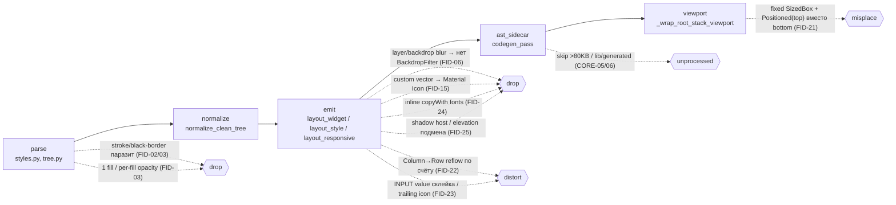

# Tier-2 Reviewer Backlog — следующий слой fidelity-дыр (FID-21+)

> Роль: ревьювер (не чиню экраны руками, не дублирую активные FID). Дата: 2026-06-05.
> Вход: [refactor-checklist.md](refactor-checklist.md) (FID-01..20), профиль `background`, реестр `CORE-*`.
> Метод: статический аудит + кросс-фикстурный grep (`tests/fixtures/layouts/*.json`) + чтение emit
> по `logs/dart/background_plan.dart`. Live Figma не дёргался; генерация/golden не запускались.
> Все findings — универсальные emit-контракты, без screen-specific и `figmaId` в `src/`.

## Внедрено (2026-06-05)

| FID | Статус | Где |
|-----|--------|-----|
| **FID-21** | done | `layout_widget`: `_should_pin_bottom`, `_resolved_bottom_offset`, `_ensure_positioned_stack_bounds` (bottom не затирается), `_wrap_root_stack_viewport` + `LayoutBuilder` при bottom-chrome |
| **FID-22** | done | `layout_responsive.should_apply_responsive_column_reflow` — только `is_layout_root` |
| **FID-24** | partial | `theme_typography.metrics_for_text_theme_slot` + `layout_style.text_style_expr` — не дублировать slot metrics в `copyWith` |
| **FID-26** | done | `generator/emit_fidelity_audit.py` → `design_coverage.emitContractGaps`; тесты `test_emit_fidelity_contracts.py` |
| **FID-30** | partial | `planned_dart._PROACTIVE_LAYOUT_DELEGATE_SCREEN_BYTES` (8KB) до LLM + реактивный 80KB |
| **FID-33** | done | `ir_validate`: `_clamp_viewport_bounds` только для прямых детей root `STACK` |

Не в этом проходе: FID-23 (date INPUT segments), FID-25 (shadow host), FID-27 (vector fail-loud), FID-28+ / FID-31–38 (pipeline spike).

## Executive summary — топ-3 риска после текущего спринта

1. **FID-21 (P0, blast: почти все экраны).** Даже когда блюр и иконки починят, **корень — фиксированный
   `SizedBox(W×H)`, а нижний chrome — `Positioned(top: N)` абсолютным Y**. Экран не адаптируется к
   высоте устройства: нав-бар «плавает» на любом не-844 вьюпорте, контент letterbox'ится. Это бьёт
   сильнее, чем любой отдельный визуальный дефект.
2. **FID-22 (P1).** `layout_responsive` рефлоит колонку в горизонтальный `Row` **по числу детей (2–4)**,
   а не по смыслу → на планшете/вебе шапка+форма+футер встают в три колонки; на мобильных артбордах
   эмитится мёртвый `LayoutBuilder`-бранч.
3. **FID-23/24 (P1).** Формы: значение INPUT склеивается из TEXT-листьев (дата-спинеры, сегменты теряют
   структуру и trailing-иконку), а типографика уходит инлайном (`copyWith(fontSize/fontWeight)`) вопреки
   контракту «no inline fonts» — theme drift на каждом экране с формой.

Плюс **FID-26**: ни одна из 4 фикстур не содержит `layerBlur`/`BOTTOM` — проблемные паттерны
**не покрыты регрессией вообще**; нужен один screen-name-agnostic CI-гейт (счётчик «потерянных
контрактов» в emit-снапшоте).

## Уже в работе — НЕ трогать

FID-06 (layer/backdrop blur), FID-15 (custom vector → Material Icon), FID-19 (edge-anchored
translucent bar шире родителя), FID-20 (профиль `background`, регенерация, `test_emit_fidelity_contracts.py`),
а также Tier-0 консолидация (`normalize_clean_tree` / отсутствующий `render_safety`) — см.
[refactor-checklist.md](refactor-checklist.md). FID-10 (inner shadow) и CORE-10 (regex postprocess) —
открыты ранее; ниже ссылаюсь, но не переоткрываю.

## Backlog (приоритет = частота × blast radius)

| FID | Sev | Blast | Симптом | Слой / файлы | Предлагаемый emit-контракт | Тест-идея |
|-----|-----|-------|---------|--------------|----------------------------|-----------|
| ~~**FID-21**~~ | P0 | Очень высокий | ~~Корень фикс-высота + `Positioned(top: N)` для bottom chrome~~ → **внедрено** | `layout_widget` | см. таблицу «Внедрено» | `test_bottom_nav_pins_bottom_not_top`, `test_root_viewport_expands_when_bottom_chrome_present` |
| ~~**FID-22**~~ | P1 | Высокий | ~~Column→Row по счёту детей~~ → reflow только `is_layout_root` | `layout_responsive` | см. «Внедрено» | `test_emit_fidelity_contracts` (no `Row(Expanded` на heterogeneous column) |
| **FID-23** | P1 | Высокий (каждая форма) | Значение INPUT склеивается из TEXT-листьев (`input_flex_value_text`): дата `[14][.][06][.][1995]` → один TextField "14.06.1995"; trailing calendar-кнопка (`Button menu`, image-fill вектор) схлопывается; сегментная семантика теряется. | parser: `interaction.input_flex_value_text`, `input_children_are_presentational`; generator: `layout_form` INPUT-ветка | Многосегментное значение (спинеры/сегменты) → корректный виджет (date/segmented), trailing-иконка → `suffixIcon`, не часть value-строки. | INPUT с 3 numeric TEXT + разделители + trailing icon → assert `suffixIcon` есть, value не «склеена» |
| **FID-24** | P1 | Высокий | Inline copyWith при совпадении со слотом | `layout_style`, `theme_typography` | **partial:** skip redundant metrics; mismatch → fix slot mapping | unit на slot-aligned node |
| **FID-25** | P2 | Средний | Эффекты помимо блюра: shadow-only ноды без fill/border могут не получить decoration-host; несколько drop-shadow теряют порядок; `derive_elevation` подменяет точную тень Material-`elevation` (теряя offset/spread). | generator: `layout_style.box_decoration_expr`, `_shadow_expr`, `styles.derive_elevation` | Все видимые эффекты в z-порядке как список `boxShadow` независимо от наличия fill; не подменять точную тень на `elevation`. (≠ FID-06 блюр; ≠ FID-10 inner shadow.) | COLUMN с 2 drop-shadow без bg → assert 2 записи `boxShadow`, порядок сохранён |
| ~~**FID-26**~~ | P1 | Инфраструктура | ~~нет счётчика потерянных контрактов~~ → **внедрено** | `emit_fidelity_audit`, `design_coverage.emitContractGaps` | счётчик `bottom_pin_used_top`, blur, opacity, vector | `test_emit_contract_audit_counts_bottom_pin_regression` |
| **FID-27** | P2 | Средний (иконки) | Нет единого владельца решения «вектор → SVG / Material / PNG»: `vector_asset_key is None` тихо даёт Material-даунгрейд (вход в FID-15). Часто экспорт SVG просто не запрошен. | assets: `assets/exporter`; parser: `render_boundary.resolve_render_boundary_asset_keys` | Каждый нетривиальный VECTOR гарантирует запрос SVG-экспорта; `vector_asset_key is None` на emit = fail-loud, а не Material-подмена. (Зависит от FID-15: сначала контракт ресолва, потом подмена.) | sweep: сколько VECTOR доходит до emit с `vector_asset_key is None` |

## Parking lot (нужен spike / низкий приоритет)

- **FID-28 (H):** emit↔sidecar/regex residue — `dart_postprocess` regex vs AST (= CORE-10). Spike: какие regex ещё в проде после Tier-0.
- **A (asset PNG-bake):** blur/filter-вектор → baked PNG (`_vector_needs_baked_raster`) — корректность DPR/масштаба. Зависит от FID-06/27.
- **G (двойной scroll):** вложенный scroll-host внутри фикс-артборда (FID-21 закроет корень; остаток — nested).
- **F (fontFamilyFallback):** каскад шрифтов в harness — relevant только при возврате golden (вне текущего скоупа).

## Где умирает fidelity (карта)

## Критерии приёмки (самопроверка)

- ✅ 7 новых FID (21–27), не дублируют FID-06/15/19/20.
- ✅ Каждый P0/P1 указывает конкретные функции/модули (не «layout плохой»).
- ✅ Нет рекомендаций «подкрутить background» / `if 362:327`.
- ✅ Один CI-гейт предложен — FID-26 (emit-snapshot «dropped contracts» counter).
- ✅ На каждый finding — тест-идея в стиле `test_emit_fidelity_contracts.py`.

---

# Tier-2b — pipeline / codegen-path (FID-30..38)

> ⚠️ **Коллизия нумерации:** входящий батч пришёл как «FID-21..29», но FID-21..28 **уже заняты** выше
> (visual-fidelity ось). Перенумеровано в **FID-30..38**, чтобы один ID не значил два разных дефекта.
> Маппинг ниже. Ось этого батча — LLM/oversized-screen/delegate path, AST-skip, repair, observability.

| Запрошенный ярлык | Присвоено | Тема |
|---|---|---|
| FID-21 (LLM screen vs delegate) | **FID-30** | oversized materialized screen → delegate (реактивно на 80KB) |
| FID-22 (AST skip 117KB) | **FID-31** | codegen AST skip на больших layout |
| FID-23 (repair vs delegate) | **FID-32** | repair бьёт в screen, ошибки в layout |
| FID-24 (IR clamp warnings) | **FID-33** | clamp по всем нодам vs parent-relative координаты |
| FID-25 (launch default) | **FID-34** | дефолтный режим dev-генерации |
| FID-26 (cross-fixture %) | **FID-35** | покрытие фикстур |
| FID-27 (CI metrics) | **FID-36** | CI-гейты |
| FID-28 (dart-error clustering) | **FID-37** | кластеризация сигнатур ошибок |
| FID-29 (css dump path) | **FID-38** | неверный путь Dev Mode CSS dump |

## Backlog FID-30..38

| FID | Sev | Симптом | Слой / файлы (verified) | Контракт / рекомендация | Blocked by / Unblocks |
|-----|-----|---------|--------------------------|--------------------------|------------------------|
| **FID-30** | P0 | LLM oversized screen → reactive 80KB delegate | `planned_dart` | **partial:** `_PROACTIVE_LAYOUT_DELEGATE_SCREEN_BYTES=8192` pre-LLM + 80KB post-emit; repair-scope / fail-loud AST — открыто | unblocks FID-31, FID-32 |
| **FID-31** | P0 | `codegen AST skipped for oversized source (117KB)` — на больших layout весь codegen-контракт (delimiter balance, unscale, flex-wrap, llm-syntax-repairs) не применяется; возможна невидимая коррупция скобок/строк. | `tools/ast_sidecar.py:45 AST_SIDECAR_MAX_SOURCE_BYTES=80_000`, `:218 passthrough`; `apply_codegen_ast_rules`; = CORE-05/06 | Chunked per-widget AST (примитивы `extract/replace_widget` есть, но сами под 80KB-гейтом) **или** fail-loud + file-split. Сравнить raw emit vs post-AST на >80KB фикстуре, зафиксировать класс коррупции. | blocked by FID-30 (меньше oversized → меньше skip) |
| **FID-32** | P0 | Repair бьёт в `screenIr@*_screen.dart`, патчи «applied», analyze даёт **те же 3 ошибки** → stagnation stop. Ошибки живут в `*_layout.dart`, которого **нет в repair-scope**. | `stages/llm_repair.py:569 target_file=screen_path`, `:801/:827 stagnation`; `llm/repair_scope.py:164-191` (target = screenIr/screenCode, screen_path) | Repair-scope должен включать `*_layout.dart` когда ошибки локализованы там; после конвертации в delegate — repair по screen **отключать** (нечего чинить), целиться в layout или deterministic-фикс. | blocked by FID-30 |
| ~~**FID-33**~~ | P1 | ~~ложные clamp на вложенных SCALE~~ → **внедрено** | `ir_validate` — только `parent_by_id == root_stack_id` | см. «Внедрено» | `test_ir_validate` / planner render-safety |
| **FID-34** | P1 | Wizard: `Codegen: LLM screen body (fail-fast)` даже при наличии dump. Неочевидно, какой режим дефолт для dev. | `cli_interactive.py` (`Codegen: …` строки), `dev/wizard.py`, `.ai-figma-flutter.yml` | См. **Decision memo** + **матрицу 4 прогонов** ниже. Рекоменд.: dev-дефолт = deterministic layout. | depends Decision memo |
| **FID-35** | P1 | Из 4 фикстур только `sign_up_and_sign_in` имеет `layerBlur`/INPUT/`hasStroke` (2 вхожд.); `music_v2`/`reminders` = 0. Грязные паттерны (frosted, bottom-dock, calendar INPUT, LEFT-overflow, stroke-без-SVG) не покрыты. | `tests/fixtures/layouts/*.json` (всего 4) | Скрипт-отчёт (grep-свод %): для каждого паттерна — доля затронутых деревьев; добавить 2–3 dirty-фикстуры. (= FID-26 visual-оси по духу, но это codegen-coverage свод.) | unblocks FID-36 |
| **FID-36** | P2 | Нет CI-гейтов на класс этих дефектов. | `design_coverage.py`, `codegen_checks.py`, `demo-signoff` | **3 гейта:** (1) `screen.dart` size < N KB **когда** `*_layout.dart` существует; (2) % нод с `layer_blur` без `BackdropFilter` в emit-снапшоте (= FID-26 счётчик); (3) `analyze` после delegate-stub должен быть зелёным (нет «осиротевших» ошибок в layout). | blocked by FID-35 |
| **FID-37** | P2 | `logs/dart-errors/*.jsonl` — какие сигнатуры systemic vs one-off после delegate/regenerate. | `dart_error_log.py`, последние сессии | Кластеризация по нормализованной сигнатуре (без figmaId/числа): топ-5; вывести в отчёт сборки. Spike. | — |
| **FID-38** | P2 | `Warning: E:\@dev\demo_app\.debug\css_dump.json` — неверный workspace → Dev Mode CSS dump не грузится → typography/borders падают на REST-синтез (без точных line-height/border из Dev Mode). | fetch-стадия pipeline, path resolution; `parser/dev_mode_css`, `enrich_node_style` (merge только если `dev_mode_css` передан) | Чинить резолв пути dump (project_dir vs agent_repo); если dump опционален — не пугать warning'ом, но не терять точность молча. | — |

## Decision memo (½ страницы) — LLM screen vs deterministic layout для dev

**Вопрос:** для экранов класса «profile editor» в dev — генерировать тело экрана через LLM или всегда детерминированный layout?

**Рекомендация: всегда deterministic layout** (`use_deterministic_screen: true`), LLM-screen — только под явный opt-in для случаев, требующих семантической реструктуризации.

**Аргументы за deterministic:**
- `*_layout.dart` генерируется **всегда** (это источник геометрии). Для плотных экранов LLM-screen раздувается >80KB и `force_oversized_*` всё равно заменяет его delegate'ом на тот же layout → **конечное состояние LLM-пути для плотных экранов = тот же delegate→layout**. Платить токенами/латентностью/repair-циклом ради того же результата — чистый waste (FID-30).
- Пиксель-перфект (цель продукта) живёт в **deterministic emit** (FID-контракты), не в LLM. LLM добавляет вариативность, не точность.
- Единственное, что уникально даёт LLM-screen-петля — visual-refine/golden — **вне скоупа** по директиве.
- Repair поверх delegate бесполезен (FID-32): ошибки в layout, scope — screen.

**Аргументы за LLM (контр):** семантическая структуризация (variant collapse, состояния) — но для статичных profile-editor не нужна и сама недостроена (variant-collapse overclaimed, см. core-audit).

**Вывод:** dev-дефолт — deterministic. Это разом обходит FID-30/31/32 для массового случая и фокусирует усилия на parse/emit фиделити.

## Матрица 4 прогонов (без выполнения всех)

| Режим | Ожидаемый артефакт | Риск |
|-------|--------------------|------|
| LLM + launch | oversized `*_screen.dart` → delegate (реактивно 80KB) | analyze-стагнация (FID-32), AST skip (FID-31), сожжённые токены (FID-30) |
| `--from-ir` + deterministic layout | только `*_layout.dart` (IR→emit без LLM screen) | fidelity без LLM — упирается в FID-контракты (06/15/21/24…) |
| dump + deterministic | эталонный baseline (быстро, воспроизводимо) | конфликт `processed/` кэша при смене парсера (CORE-21) |
| LLM + `use_deterministic_screen: true` | конфликт настроек: deterministic layout + LLM флаг | config: какой путь побеждает? нужен явный приоритет/ошибка |

## Spike — один универсальный emit-gate (не screen-specific)

**Идея:** перенести конвертацию в delegate из **реактивной пост-emit (80KB)** в **проактивную (до LLM/repair, порог ~8KB) при наличии layout**.

- **Правило:** если `planned` будет содержать `lib/generated/{feature}_layout.dart` **и** материализуемый/материализованный `*_screen.dart` > **8KB** → сразу эмитить delegate stub `const {Feature}Layout()` с **обязательными импортами** (theme/app_colors, app_spacing, app_layout, при необходимости svg), не гоняя LLM на полный screen и не входя в repair.
- **Где:** перед `materialize_screen_code_from_ir` / в plan-стадии; обобщает `_screen_is_layout_delegate` (planned_dart:485) и `force_oversized_*` (510), но проактивно.
- **Почему универсально:** условие структурное (есть layout + размер), без имён экранов/figmaId.
- **Эффект:** закрывает FID-30 (waste), снижает FID-31 (меньше oversized → меньше AST-skip), снимает FID-32 (repair не бьёт в выброшенный screen).
- **Тест:** фича с большим деревом → assert `*_screen.dart` = delegate stub с нужными импортами, LLM screen-body не вызывался, repair-scope не включает screen.

## Критерии приёмки Tier-2b

- ✅ FID-30..38 не дублируют FID-06/15/19/20 и FID-21..28 (другая ось — pipeline/codegen-path).
- ✅ P0 с конкретными функциями (`force_oversized_feature_screens_to_layout`, `_clamp_viewport_bounds`, `repair_scope`), не «pipeline плохой».
- ✅ Decision memo без кода; матрица 4 прогонов; spike — один универсальный emit-gate.
- ✅ Коллизия ID разрешена явным маппингом.
