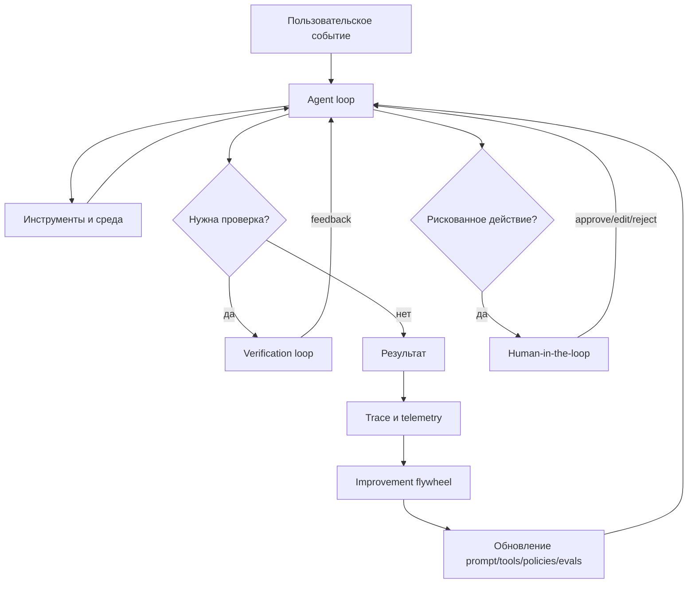
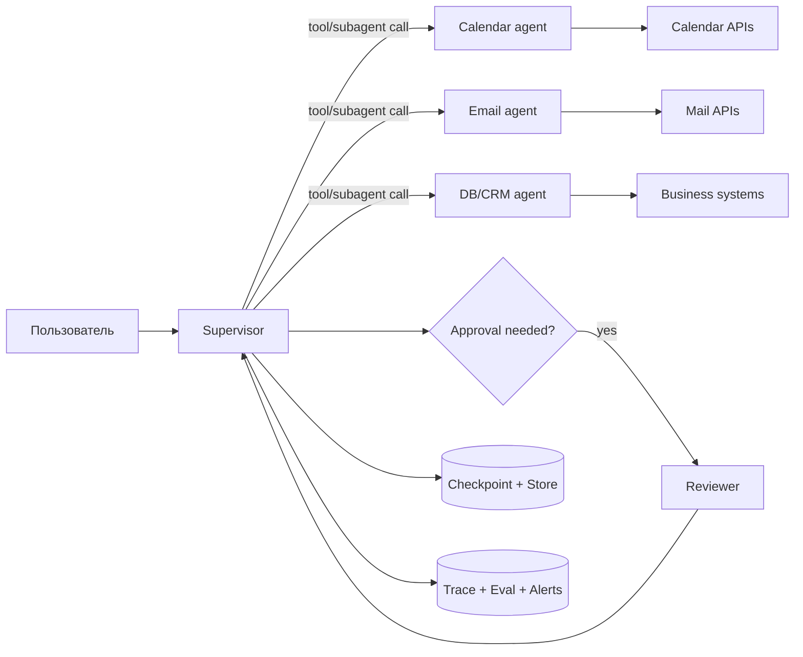
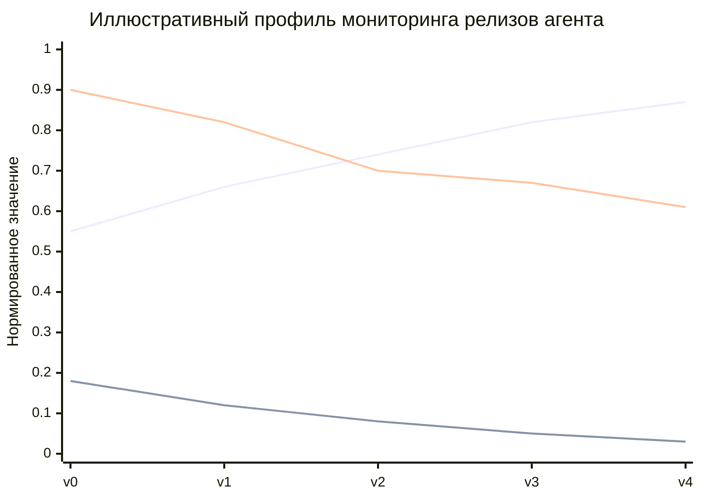

# Loop engineering для разработки AI-агентов

## Исполнительное резюме

Этот отчёт подготовлен для неуточнённой, но предположительно инженерной аудитории уровня **middle–advanced ML/AI**. Термин **loop engineering** пока не является строго стандартизованным академическим термином: в индустрии он пересекается с **harness engineering**, **agent engineering**, **context engineering**, оркестрацией, eval-driven development и improvement flywheels. В практическом смысле речь идёт о проектировании, ограничении, наблюдении и постоянном улучшении циклов, внутри которых модель получает контекст, вызывает инструменты, обрабатывает наблюдения, принимает решение о завершении или эскалации и затем попадает в следующий цикл обратной связи. citeturn20view0turn20view2turn20view1turn17view0

Главный вывод из официальной документации и инженерных блогов крупных команд один и тот же: **надёжность агента возникает не из “магического промпта”, а из хорошо спроектированного harness-а** — то есть слоя исполнения вокруг модели: ограниченных инструментов, чётких контрактов входа/выхода, правил остановки, checkpoint-ов, guardrails, трассировки, evals и human-in-the-loop для рискованных действий. Anthropic прямо рекомендует начинать с простых композиционных паттернов, а LangChain и OpenAI подчёркивают важность управляемого runtime-состояния, оркестрации и human review. citeturn16view3turn12view3turn22view2turn10view0

Наиболее практичная стратегия внедрения выглядит как лестница зрелости. Сначала — **детерминированный workflow** там, где путь заранее известен. Затем — **single-agent tool loop**. Дальше, если появляются перегрузка контекста, слишком широкий набор инструментов или раздельные зоны ответственности команд, — **subagents, handoffs, router/skills**. После этого обязательны **offline и online evals**, трассировка шагов, выборочные проверки человеком и только потом — масштабирование, cost optimization и, при наличии качественных траекторий и reward-сигналов, **RL или reinforcement fine-tuning**. Иначе легко построить дорогую, нестабильную и чертовски убедительную машину галлюцинаций. citeturn12view0turn12view2turn21view4turn10view1turn15search0turn18view4

Для production-среды базовый стек лучших практик сегодня выглядит так: **durable execution и persistence** для долгих прого́нов, **structured tool calling** или безопасный sandbox для code agents, **trace + eval flywheel** для постоянного улучшения, **guardrails и approvals** для рискованных операций, **Prometheus/Grafana + OTel/trace platform** для операционной телеметрии, а для стоимости — сокращение числа запросов, контекстная компакция, prompt caching, batch/flex режимы и автоскейлинг serving-слоя. citeturn9view2turn21view2turn10view2turn10view1turn13view1turn29search0turn29search19turn11view3turn10view3turn10view4turn24search0

## Терминология и концептуальная модель

В современных агентных системах полезно различать не один “цикл агента”, а **стек циклов**. LangChain в свежем инженерном разборе описывает как минимум четыре уровня: базовый agent loop, verification loop, event-driven loop и hill-climbing loop для улучшения harness-а по traces. Hugging Face в глоссарии отдельно разводит **harness** как исполнительный слой, **scaffold** как инструктивно-инструментальный контур и **context engineering** как дисциплину отбора того, что модель видит на каждом шаге. Это важное уточнение: в разговоре “агент” часто звучит как что-то монолитное, а на деле основная инженерная работа происходит **вокруг** модели, а не внутри неё. citeturn34view0turn20view2turn17view0turn21view1

Ниже — практическая таксономия циклов, полезная для проектирования.

| Тип loop | Что замыкается в цикле | Типичный сигнал управления | Где полезен | Основные риски | Опора |
|---|---|---|---|---|---|
| **Agent loop** | `контекст → модель → tool call → observation → ... → finish` | tool result, stop condition, max steps | tool-use агент, RAG, coding agent | бесконечные циклы, tool hallucination, контекстное разрастание | citeturn21view0turn21view1turn30view0 |
| **Feedback / verification loop** | `ответ/траектория → grader → feedback → retry` | rubric score, test pass/fail, LLM judge, human review | когда важны точность и консистентность | рост latency/cost; bias у judge-модели | citeturn34view0turn10view1turn15search0turn15search18 |
| **Control loop** | `monitor → analyze → plan → execute` | telemetry, policy, anomalies | автономное управление run-time, rate/cost/safety governance | плохой policy design, oscillation, delayed feedback | citeturn7search3turn7search12 |
| **RL loop** | `state → action → reward → update policy` | reward, episode return, advantage | обучаемые агенты, симуляторы, multi-agent RL | дорогие rewards, credit assignment, unsafe exploration | citeturn11view0turn7search0turn18view4 |
| **Human-in-the-loop** | `proposed action → interrupt → human decision → resume` | approve/edit/reject/respond | irreversible actions: SQL, email, money, deletes | bottleneck, review fatigue, UX friction | citeturn9view3turn21view2turn10view0 |
| **Improvement flywheel** | `production trace → eval dataset → harness/model change → redeploy` | failures, annotations, online evals | зрелые production-команды | накопление шума без хорошей селекции кейсов | citeturn9view4turn10view1turn34view0 |

Практически **loop engineering** — это проектирование того, **какие циклы нужны**, **где они начинаются и заканчиваются**, **какой у них бюджет**, **какой у них источник правды** и **когда они должны передать задачу наружу** — другому агенту, deterministic workflow, человеку или системе оценки. Без этой явной декомпозиции команда быстро получает “агента”, который делает всё, ничего не гарантирует и при этом жрёт токены как голодный дата-центр в январе. citeturn20view2turn21view1turn16view3



С практической точки зрения удобно принять следующую рабочую формулу:

> **Loop engineering = harness design + context engineering + evaluation loops + safety/control loops + operational telemetry.**  
> Это не отдельная “магия”, а инженерная дисциплина по управлению состоянием, действиями и обратной связью. citeturn20view2turn17view0turn10view1turn24search0

## Архитектурные паттерны loop engineering

Базовое архитектурное различие проходит между **workflow** и **agent**. LangGraph определяет workflow как систему с заранее известными кодовыми путями, а agent — как систему, которая динамически определяет собственный путь и использование инструментов. Это distinction критично: если у тебя последовательность шагов известна заранее, агент может быть избыточен и просто добавит вариативность, cost и новые классы отказов. citeturn12view0turn12view4

Anthropic и LangChain сходятся ещё в одном: **начинать нужно как можно проще**, обычно с одного агента и хороших инструментов. Multi-agent имеет смысл, когда действительно появляются: перегруженный контекст, слишком широкий и пересекающийся tool-set, необходимость параллельной работы или чёткие границы между доменными зонами и командами. Преждевременный multi-agent — это классический способ усложнить дебаг так, чтобы даже логам стало неловко. citeturn16view3turn12view2turn21view4

### Сравнение основных архитектурных паттернов

| Паттерн | Когда выбирать | Кто владеет ответом | Сильные стороны | Основные издержки | Источники |
|---|---|---|---|---|---|
| **Workflow / state machine** | путь шагов заранее известен | код/оркестратор | предсказуемость, тестируемость, дешёвый дебаг | ниже гибкость | citeturn12view0 |
| **Single agent + tools** | большинство прикладных задач | один agent harness | минимальная сложность, быстрая итерация | перегрузка при росте числа tools/контекста | citeturn21view0turn12view2 |
| **Supervisor + subagents** | разные домены, нужен централизованный контроль | supervisor | context isolation, параллельный вызов subagents, удобные границы ownership | дополнительный model call, выше latency | citeturn12view1turn21view3turn12view2 |
| **Handoffs** | нужен переход владения диалогом к specialist | specialist agent | естественно для branch-specific ownership | сложнее state continuity и policy routing | citeturn9view1turn22view2 |
| **Router / classifier dispatch** | нужно быстро направить запрос по вертикалям | router step | быстро, дёшево, просто | мало памяти о ходе диалога | citeturn21view4turn12view2 |
| **Skills / progressive disclosure** | один агент, но много специализаций | главный агент | снижает токен-блоут, сохраняет простоту | нужно хорошо организовать skill loading | citeturn12view2 |
| **Event-driven agents** | агент должен реагировать на webhooks, cron, новые документы | runtime/trigger layer | встраивание агента в реальную экосистему | нужны durable state и idempotency | citeturn34view0 |

Для долгоживущих систем хороший loop design почти всегда требует **явного состояния**. LangGraph делает persistence базовым примитивом: checkpoints нужны для короткой памяти, time travel, fault tolerance и HITL, а stores — для долговременной памяти и shared knowledge. OpenAI Agents SDK, в свою очередь, различает session-based state и server-managed state, предупреждая, что смешивание стратегий без явного reconciler-а может дублировать контекст. Это не академическая придирка: так и рождаются “почему он второй раз отправил письмо?” и прочий корпоративный фольклор. citeturn9view2turn12view3turn22view1

Ещё один архитектурный принцип — **инструменты должны быть разделены по ясным контрактам**. Anthropic подчёркивает, что bloated tool sets и перекрывающиеся по смыслу инструменты создают ambiguous decision points. Если инженер не может однозначно сказать, какой tool нужен для класса задач, от модели ждать большего — занятие с оттенком мазохизма. LangChain аналогично рекомендует разбивать context и tools по ролям, а supervisor-pattern использовать для логического partitioning domains. citeturn17view0turn17view1turn12view1



Практический выбор паттерна можно свести к трём вопросам. Если путь уже известен — бери workflow. Если путь неизвестен, но домен один и инструменты обозримы — single agent. Если доменов несколько, инструменты конфликтуют, а команды независимы — subagents, handoffs или skills в зависимости от того, нужна ли централизованная оркестрация, передача владения диалогом или просто selective context loading. citeturn12view0turn12view2turn21view4turn9view1

## Алгоритмические подходы

Алгоритмически loop engineering распадается на два больших класса: **inference-time loops** и **training-time loops**. Первые улучшают поведение агента без обновления весов модели; вторые превращают траектории агента в обучающий сигнал для policy/model update. На практике большинство production-команд сначала выжимают всё из inference-time loop design, и это логично: менять harness дешевле, быстрее и безопаснее, чем сразу лезть в RL. citeturn19view1turn19view0turn18view4turn15search0

### Сравнение алгоритмических подходов

| Подход | Класс | Как работает | Когда полезен | Ограничения | Источники |
|---|---|---|---|---|---|
| **ReAct** | inference-time | чередует reasoning traces и actions | tool use, search, web/navigation, interpretable trajectories | может раздувать контекст и число шагов | citeturn18view0 |
| **Self-Refine** | inference-time | генерация → self-feedback → refinement | когда нужен improvement без тренировки | риск самоповтора и ложной самоуверенности | citeturn19view1 |
| **Reflexion** | inference-time / memory-based | словесная рефлексия и episodic memory между попытками | coding, sequential tasks, fast adaptation | требует хорошего feedback signal | citeturn19view0 |
| **Verification / rubric loop** | inference-time | grader оценивает output, при fail агент повторяет шаг | production-grade correctness | дороже и медленнее одношагового ответа | citeturn34view0turn10view1 |
| **Toolformer** | training-time | модель обучается решать, когда вызывать API | частое повторяемое tool use | сложнее data pipeline и post-training | citeturn19view2 |
| **RLHF / RFT** | training-time | демонстрации/ранжирования/reward для alignment | выравнивание поведения под человеческие предпочтения | дорого, нужен качественный feedback | citeturn7search0turn13view0 |
| **RLlib episode loop** | training-time | collecting episodes → train batch → update policy | симуляторы, multi-agent RL, decision tasks | нужен env/reward, не волшебная палочка для LLM apps | citeturn11view0turn26view2 |
| **Agent Lightning** | training-time for agents | отделяет agent runtime от RL training, делает trajectories универсальными transitions | когда есть существующий агент и хочется RL без полной переписки стека | всё ещё требует reward design и зрелой observability | citeturn18view4 |
| **DAgger / correction aggregation** | interactive imitation | собирает corrective actions по траекториям, снижая distribution shift | human correction loops, expert demonstrations | нужен эксперт и режим интерактивного сбора | citeturn7search1 |

Для LLM-агентов в продакшене самым полезным оказывается не “чистый RL”, а **грамотная композиция inference-time loops**. ReAct хорош там, где агенту нужно чередовать мыслительный шаг и обращение к миру. Self-Refine и Reflexion полезны, когда первая попытка часто недостаточна, но можно получить внутреннюю или внешнюю обратную связь. В инженерных системах это естественно сочетается с verification loop: тесты, schema validation, линтеры, ссылочные проверки, SQL execution checks, unit tests для generated code. Именно так LangChain описывает verification loop, а OpenAI — iterative repair loop для Codex. citeturn18view0turn19view1turn19view0turn34view0turn5search16

Важный практический принцип: **каждый loop должен иметь явные stop conditions**. В OpenAI function-calling flow цикл продолжается, пока модель возвращает tool calls; завершение наступает, когда приходит финальное message output. В smolagents есть `max_steps`, termination via `final_answer`, а также дополнительные `final_answer_checks`, которые позволяют не доверять “готово” на слово и проверять финальный ответ валидаторами. Это очень взрослая инженерная привычка: не просто спросить модель “ты закончила?”, а заставить её пройти турникет. citeturn30view0turn30view1turn31view0

Если у команды уже накопились production traces, разметка экспертов и надёжные rubrics, следующий шаг — не обязательно немедленный RL. Часто лучше сначала сделать **improvement flywheel**: отбирать провальные traces, превращать их в eval dataset, измерять regressions и лишь потом решать, достаточно ли harness-тюнинга, нужен ли synthetic data generation, supervised fine-tuning или уже reward-driven optimization. Именно эту последовательность показывают OpenAI в guide по improvement loop и LangSmith в offline/online evaluation workflow. citeturn9view4turn10view1turn15search0

## Метрики качества, безопасности и наблюдаемости

Для агентных систем не существует одной “главной метрики”. Нужен как минимум **четырёхслойный набор**: outcome metrics, step metrics, system metrics и safety metrics. LangSmith и MLflow подчёркивают, что LLM-выходы недетерминированы и оценка должна разбивать “что такое хорошо” на проверяемые составляющие; tracing затем позволяет измерять не только итог, но и промежуточные решения. citeturn15search2turn27search20turn27search1

### Практическая матрица метрик

| Слой | Метрика | Что измеряет | Где брать | Источники |
|---|---|---|---|---|
| **Outcome** | task success rate / pass rate | доля задач, решённых корректно end-to-end | offline datasets, online evals, human review | citeturn10view1turn15search0 |
| **Outcome** | groundedness / factuality | насколько ответ опирается на источники и tool outputs | reference-based evals, rubric, LLM judge | citeturn10view0turn15search1turn15search2 |
| **Step** | tool selection accuracy | выбран ли правильный инструмент | traces + labeled trajectories | citeturn27search4turn24search13 |
| **Step** | tool argument validity | корректность аргументов и schema adherence | trace graders, runtime validation, strict schema | citeturn10view0turn22view3 |
| **System** | latency p50/p95/p99 | задержка на run/trace/step | LangSmith perf metrics, APM, OTel | citeturn15search8turn15search14turn24search0 |
| **System** | TTFT / TPOT | latency до первого токена и на токен | Ray Serve LLM, engine metrics | citeturn10view3 |
| **System** | queue size / batch size / throughput | давление на serving layer | TGI Prometheus metrics, Grafana | citeturn10view4turn14view4 |
| **System** | tokens / cost per successful task | экономичность loop-а | usage telemetry, LangSmith/OpenAI | citeturn15search8turn15search20turn13view1 |
| **Safety** | jailbreak / prompt injection detection rate | устойчивость к атакам | guardrails, red teaming, security evals | citeturn10view0turn27search0turn27search3 |
| **Safety** | approval override / reject rate | сколько действий человек блокирует или правит | HITL logs | citeturn9view3turn21view2 |
| **Safety** | sandbox incident rate | попытки или успехи unsafe execution | sandbox audit, executor telemetry | citeturn14view0turn25search13 |

На практике полезно считать не только “общую стоимость” и “общую latency”, а **стоимость и latency на успешную задачу**. Один дешёвый прогон, который потом идёт по кругу ещё три раза, часто хуже одного чуть более дорогого verification loop, который завершает задачу за одну-две итерации. OpenAI в cost optimization прямо рекомендует сокращать число запросов и токенов, а LangChain в multi-agent analysis показывает, что архитектурный выбор влияет не только на latency, но и на общий token footprint через контекстную изоляцию. citeturn13view1turn12view2

Наблюдаемость в агентных системах должна быть **trace-centric**. OpenTelemetry определяет trace как дерево spans, а LangSmith прямо сопоставляет trace-ы со span-деревьями. Для AI-агентов это особенно важно, потому что failures часто происходят не как красочный 500-й, а как “всё зелёное, но ответ какой-то подозрительно тупой”. Трассировка должна фиксировать tool selections, аргументы, retrieved context, state transitions, retries, approvals, cost и latency на каждом шаге. citeturn24search0turn24search4turn24search8turn24search23turn10view2

LLM-as-a-judge полезен, но опасен при некритичном использовании. MT-Bench показал biases judge-моделей — position, verbosity, self-enhancement. OpenAI дополнительно подчёркивает, что judge нужно калибровать на gold-standard data и что обычная accuracy на несбалансированных pass/fail наборах может быть обманчивой. Поэтому для high-stakes сценариев judge должен быть **не единственным арбитром**, а частью микса из human review, code rules, pairwise comparison и targeted rubrics. citeturn15search18turn15search4turn10view1



График выше — **иллюстративная схема**, а не эмпирические данные. Его смысл простой: правильный outer loop должен одновременно поднимать success, снижать safety incidents и уменьшать cost per successful task, иначе у тебя не improvement loop, а просто красиво оформленный self-sabotage.

## Инфраструктура, CI/CD, масштабирование и затраты

Для долгих и рискованных агентных процессов инфраструктура должна поддерживать **durability, resumability и controllability**. LangGraph persistence делает checkpoints и stores основой для short-term и long-term memory, а OpenAI Agents SDK рекомендует sessions как лучший default, когда нужна durable memory, resumable approvals и контроль приложения над storage. Без этого любая пауза, сетевой обрыв или review gate превращается в “ну давай ещё раз с начала”, а это прямой путь к удвоению cost и хаосу в side effects. citeturn9view2turn22view1

Для открытых моделей и code agents serving-слой должен проектироваться отдельно от orchestration-слоя. Ray Serve LLM даёт OpenAI-compatible serving, built-in autoscaling, routing, multi-node deployment, observability и fault tolerance, а Ray autoscaler масштабирует реплики на основе queue size и target ongoing requests. Hugging Face TGI, в свою очередь, экспонирует Prometheus-метрики по `/metrics`, включая queue size, batch sizes, prefill/decode latency и количество токенов, и интегрируется с Grafana. Это как раз тот случай, когда DevOps-ад уже давно формализован — не изобретай свой велосипед с квадратными колёсами, если можно взять стандартный. citeturn11view3turn11view2turn14view4turn10view4

С точки зрения безопасности, два базовых принципа непреложны. Первый: **рискованные tool calls должны проходить через approval или policy gate**. OpenAI рекомендует включать approvals для MCP tools и не позволять untrusted data напрямую управлять поведением агента; LangChain HITL pattern строится на durable interrupts с approve/edit/reject/respond. Второй: **LLM-generated code нельзя исполнять без sandbox strategy**. Smolagents прямо предупреждает, что `CodeAgent` по умолчанию генерирует исполняемый код и потому требует осторожности с imports и, для серьёзных систем, отдельного безопасного executor-а вроде Docker/E2B/Blaxel. citeturn10view0turn9view3turn14view0turn25search13

Для CI/CD агентных приложений обычного “pytest + deploy” уже мало. Нужны, как минимум: unit tests для deterministic частей, replay/trace tests для loop logic, offline evals на curated dataset, security/red-team checks, deployment approvals и observability gates. GitHub Actions поддерживает dependency cache для Python, environment protection rules и required reviewers; OpenAI workload identity federation позволяет аутентифицироваться из CI через GitHub OIDC без хранения long-lived API keys в секретах. Это сильно уменьшает blast radius, особенно когда в пайплайне есть доступ к моделям, продовым сервисам и eval infrastructure. citeturn3search1turn28view2turn28view0turn28view1

С точки зрения стоимости ключевые рычаги повторяются во всех зрелых системах. OpenAI рекомендует: уменьшать число запросов, сокращать токены и выбирать модель не “самую большую”, а подходящую по качеству/цене/latency. Дополнительно доступны Prompt Caching, Batch API и Flex processing; prompt caching, по официальным данным OpenAI, может существенно снижать latency и input cost на повторяющихся префиксах, а Batch API даёт отдельный пул более высоких rate limits и 50% lower costs для асинхронных batch jobs. Для long-running runs важна и context compaction: LangChain Deep Agents и OpenAI context management предлагают штатные механизмы compaction/summarization. citeturn13view1turn29search0turn29search19turn29search8turn29search2turn29search16

Наконец, планируя масштабирование, надо учитывать rate limits и queuing semantics. OpenAI rate limits считаются по RPM, TPM и другим квотам на уровне organization/project, а Batch API имеет отдельные queue limits по input tokens. Если этого не учитывать, внешне “умный” loop начнёт деградировать под нагрузкой и случайно обучит команду ненавидеть собственный релизный календарь. citeturn13view3

### Шаблон CI/CD для агентного сервиса

Ниже — **практический шаблон**, совместимый с рекомендациями GitHub Actions по кэшированию Python, environment approvals и с OpenAI workload identity federation через `id-token: write`. Под конкретную организацию его всё равно надо доточить напильником, но каркас нормальный. citeturn3search1turn28view0turn28view2

```yaml
name: agent-ci-cd

on:
  pull_request:
  push:
    branches: [main]

permissions:
  contents: read
  id-token: write

jobs:
  test-and-evals:
    runs-on: ubuntu-latest
    env:
      OPENAI_WIF_AUDIENCE: ${{ vars.OPENAI_WIF_AUDIENCE }}
      OPENAI_IDENTITY_PROVIDER_ID: ${{ vars.OPENAI_IDENTITY_PROVIDER_ID }}
      OPENAI_SERVICE_ACCOUNT_ID: ${{ vars.OPENAI_SERVICE_ACCOUNT_ID }}
      LANGSMITH_TRACING: "true"
      LANGSMITH_API_KEY: ${{ secrets.LANGSMITH_API_KEY }}
    steps:
      - uses: actions/checkout@v6

      - uses: actions/setup-python@v5
        with:
          python-version: "3.12"
          cache: "pip"

      - run: pip install -r requirements.txt
      - run: pip install -r requirements-dev.txt

      - name: Unit tests
        run: pytest -m "not integration" -q

      - name: Offline eval suite
        run: python scripts/run_offline_evals.py --dataset evals/golden.yaml --fail-under 0.85

      - name: Security red-team smoke test
        run: python scripts/run_redteam_smoke.py --config redteam/prompt_injection.yaml

  deploy:
    needs: test-and-evals
    if: github.ref == 'refs/heads/main'
    runs-on: ubuntu-latest
    environment: production
    steps:
      - uses: actions/checkout@v6
      - uses: actions/setup-python@v5
        with:
          python-version: "3.12"
          cache: "pip"

      - run: pip install -r requirements.txt

      - name: Deploy agent service
        run: python scripts/deploy.py --env production
```

### Шаблон alerting rules для serving-слоя

Prometheus рекомендует задавать alert conditions через rules и отправлять их в Alertmanager; TGI и Ray уже дают полезную AI-специфичную телеметрию для alerting. Ниже — отправная точка. citeturn23search4turn23search7turn10view4turn10view3

```yaml
groups:
  - name: llm-serving
    rules:
      - alert: TGIQueueBacklogHigh
        expr: tgi_queue_size > 50
        for: 5m
        labels:
          severity: warning
        annotations:
          summary: "Очередь TGI растёт"
          description: "Сервис перегружен; проверь автоскейлинг, batch sizing и upstream rate limits."

      - alert: AgentLatencyP99High
        expr: histogram_quantile(0.99, sum(rate(http_request_duration_seconds_bucket[5m])) by (le)) > 12
        for: 10m
        labels:
          severity: critical
        annotations:
          summary: "P99 latency агента выше SLO"

      - alert: AgentSafetyRejectSpike
        expr: rate(agent_hitl_reject_total[15m]) > 0.05
        for: 15m
        labels:
          severity: warning
        annotations:
          summary: "Резкий рост отклонённых действий"
```

## Практические реализации и сравнение фреймворков

Ниже — краткое сравнение стеков, которые чаще всего встречаются в реальных agent loops.

| Фреймворк / стек | Что особенно силён делать | Ключевые примитивы loop engineering | Когда брать | Ограничения | Источники |
|---|---|---|---|---|---|
| **OpenAI Responses API / Agents SDK** | ручной tool loop, hosted tools, stateful runs, guardrails, handoffs | tools, sessions/state, guardrails, orchestration, background mode | SaaS-first агенты и production APIs | нужен свой orchestration layer для нестандартных runtime policies | citeturn22view0turn22view1turn22view2turn30view0 |
| **LangChain + LangGraph + LangSmith** | harness composition, durable graphs, HITL, persistence, eval/observability | `create_agent`, middleware, interrupts, checkpoints, stores, traces, evaluators | самый гибкий general-purpose stack | легко переусложнить graph, если забыть начать с простого | citeturn21view0turn12view3turn9view2turn10view1turn10view2 |
| **Ray Serve + Ray Data + RLlib** | distributed serving, batch inference, RL training, multi-agent envs | autoscaling, OpenAI-compatible serving, env runners, training iterations | высоконагруженный serving, RL, batch pipelines | больше infra weight, чем у purely API-first стеков | citeturn11view3turn11view4turn26view2turn11view1 |
| **Hugging Face smolagents + TGI** | lightweight agents, code agents, open-weight serving | `CodeAgent`, `ToolCallingAgent`, secure executors, Prometheus metrics | open source / on-prem / OSS model stack | code agents требуют жёсткой sandbox discipline | citeturn26view0turn14view0turn31view2turn14view4 |
| **Promptfoo / MLflow / LangSmith** | eval-driven loops, trace scoring, regression gates | datasets, graders, scheduled scorers, online/offline evals | поверх любого runtime | это не runtime, а outer loop instrumentation | citeturn10view1turn27search20turn27search16turn27search0 |

### Пример OpenAI Responses API с ручным tool loop

OpenAI официально описывает tool calling как многошаговый цикл: дать модели tools, получить tool call, выполнить код на стороне приложения, вернуть tool output и повторять до финального сообщения. Cookbook отдельно показывает общий `while`-шаблон для reasoning + function calls. citeturn30view1turn30view0

```python
from openai import OpenAI
import json

client = OpenAI()

tools = [{
    "type": "function",
    "name": "search_docs",
    "description": "Search internal docs by keyword",
    "parameters": {
        "type": "object",
        "properties": {
            "query": {"type": "string"}
        },
        "required": ["query"]
    }
}]

def search_docs(query: str) -> str:
    # Здесь должна быть интеграция с реальной БД/поиском
    return f"Top docs for query={query!r}"

tool_mapping = {"search_docs": search_docs}

def invoke_tools(response):
    outputs = []
    for item in response.output:
        if item.type == "function_call":
            args = json.loads(item.arguments)
            result = tool_mapping[item.name](**args)
            outputs.append({
                "type": "function_call_output",
                "call_id": item.call_id,
                "output": result,
            })
    return outputs

response = client.responses.create(
    model="gpt-5.5",
    input="Найди документацию по checkpoint recovery и кратко объясни best practices.",
    tools=tools,
)

while True:
    tool_outputs = invoke_tools(response)
    if not tool_outputs:
        print(response.output_text)
        break

    response = client.responses.create(
        model="gpt-5.5",
        previous_response_id=response.id,
        input=tool_outputs,
        tools=tools,
    )
```

### Пример LangChain agent harness

LangChain позиционирует `create_agent` как minimal, highly configurable harness: модель, tools, prompt и middleware. Это хороший старт для single-agent loop перед переходом к LangGraph flow и multi-agent orchestration. citeturn32view0turn32view1

```python
from langchain.agents import create_agent

def get_weather(city: str) -> str:
    """Get weather for a given city."""
    return f"It's always sunny in {city}!"

agent = create_agent(
    model="openai:gpt-5.5",
    tools=[get_weather],
    system_prompt="You are a helpful assistant. Use tools when needed."
)

result = agent.invoke({
    "messages": [
        {"role": "user", "content": "Какая погода в Сан-Франциско?"}
    ]
})

print(result["messages"][-1].content_blocks)
```

Если нужен durable execution, поверх этого разумно сразу добавлять checkpointer и tracing, а для sensitive tools — interrupts/HITL. Именно такая эволюция рекомендована в документации LangChain/LangGraph. citeturn12view3turn9view2turn21view2

### Пример RL loop на RLlib

RLlib строит обучение как повторяющиеся training iterations: параллельный сбор sample trajectories через EnvRunners, формирование train batch и update модели. Это хороший образец для **RL loops**, но не замена inference-time harness-а для обычных бизнес-агентов. citeturn11view0turn26view2

```python
from pprint import pprint
from ray.rllib.algorithms.ppo import PPOConfig
from ray.rllib.connectors.env_to_module import FlattenObservations

config = (
    PPOConfig()
    .environment("Taxi-v3")
    .env_runners(
        num_env_runners=2,
        env_to_module_connector=lambda env: FlattenObservations(),
    )
    .evaluation(evaluation_num_env_runners=1)
)

algo = config.build_algo()

for _ in range(5):
    pprint(algo.train())

pprint(algo.evaluate())
algo.stop()
```

### Пример open-source code agent на smolagents

Hugging Face предлагает два базовых режима: `CodeAgent`, который пишет tool calls как Python code, и `ToolCallingAgent`, который использует JSON-like structured calls. Первый выразительнее, второй предсказуемее и безопаснее. Для production `CodeAgent` нужно использовать только вместе с продуманной sandbox policy. citeturn26view0turn14view0turn31view2

```python
from smolagents import CodeAgent, InferenceClientModel, DuckDuckGoSearchTool

model = InferenceClientModel()
agent = CodeAgent(
    tools=[DuckDuckGoSearchTool()],
    model=model,
)

result = agent.run("What is the current weather in Paris?")
print(result)
```

### Пример production-конфига Ray Serve LLM

Ray Serve LLM поддерживает config-driven deployments с YAML и OpenAI-compatible ingress. Это полезно, когда loop orchestration уже есть, а serving хочется вынести в отдельный масштабируемый слой. citeturn26view1

```yaml
applications:
  - args:
      llm_configs:
        - model_loading_config:
            model_id: qwen-0.5b
            model_source: Qwen/Qwen2.5-0.5B-Instruct
          accelerator_type: A10G
          deployment_config:
            autoscaling_config:
              min_replicas: 1
              max_replicas: 2
    import_path: ray.serve.llm:build_openai_app
    name: llm_app
    route_prefix: "/"
```

## Кейсы, анти-паттерны и чек-листы

### Реальные инженерные кейсы

**OpenAI Codex CLI** — показательный кейс того, что “агент” в серьёзной системе фактически равен **harness-у вокруг модели**. OpenAI прямо описывает agent loop Codex как core logic, которая оркестрирует взаимодействие пользователя, модели и инструментов, а отдельно подчёркивает, что по мере роста истории разговора управление context window становится одной из первичных обязанностей harness-а. Это хороший урок: если твой loop не умеет управлять контекстом, он не зрелый, он просто бодрый. citeturn16view0

**Uber Enhanced Agentic RAG** показывает более прикладной enterprise-сценарий: оркестрация построена на LangGraph, текущая реализация следует последовательному flow, но выбранный runtime позволяет эволюционировать в более сложные агентные структуры. Здесь важен не пафос “у нас агенты”, а трезвый выбор последовательного pipeline с запасом на усложнение. Это и есть взрослая архитектура, а не ярмарка тщеславия для диаграмм. citeturn16view1

**Uber Agent Identity** — кейс уже не только качества, но и governance. Поскольку agentic workflows по умолчанию композитны и динамичны, Uber построил STS для short-lived scoped tokens, MCP Gateway как policy enforcement point и AI Gateway как единый выход к внешним моделям с guardrails против prompt injection, jailbreaks и PII leaks. Для enterprise-агентов lesson предельно ясен: как только агент начинает вызывать другие агенты и инструменты, **identity propagation и provenance** становятся частью loop engineering, а не “потом как-нибудь приделаем”. citeturn16view2

**Anthropic tool optimization workflow** — хороший пример outer improvement loop. Компания рекомендует сначала быстро прототипировать tools, затем строить eval tasks из реальных сценариев, после чего использовать агента для автоматического улучшения самих tool descriptions, specs и behaviors. Иначе говоря: инструмент — это не “функция для модели”, а контракт между deterministic system и nondeterministic agent, который надо проектировать под восприятие модели. citeturn17view1

### Частые анти-паттерны

| Анти-паттерн | Почему это плохо | Чем заменить | Источники |
|---|---|---|---|
| **Сразу строить multi-agent систему** | сложнее дебаг, дороже, больше latency без необходимости | начать с single agent или workflow | citeturn16view3turn12view2 |
| **Раздутый, пересекающийся tool-set** | агент не понимает, какой инструмент выбрать | минимальный и чётко разделённый набор tools | citeturn17view0turn17view1 |
| **Бритвенно хрупкий или слишком расплывчатый system prompt** | brittle logic на одном краю и потеря управляемости на другом | короткие структурированные секции, canonical few-shots, iterative refinement | citeturn17view0 |
| **Нет persistence/checkpoints** | long-running run не переживает pause/failure/HITL | durable state, checkpoints, session memory | citeturn9view2turn22view1 |
| **Untrusted text напрямую влияет на tool calls** | prompt injection гуляет по системе как у себя дома | structured outputs, sanitization, isolation, approvals | citeturn10view0 |
| **Code agent без sandbox discipline** | риск unsafe execution и непредсказуемых side effects | secure executor, allowlist imports, Docker/E2B/remote sandbox | citeturn14view0turn25search13 |
| **Смешивание state strategies без reconciliation** | дублирование контекста и side effects | выбрать один state strategy per conversation | citeturn22view1 |
| **Нет eval flywheel** | повторяющиеся ошибки не превращаются в regression tests | traces → dataset → evaluators → rollout gate | citeturn10view1turn9view4turn34view0 |

### Чек-лист проектирования loop

- [ ] **Определён ли тип loop**: workflow, single-agent, supervisor, handoff, event-driven, RL? citeturn12view0turn34view0  
- [ ] **Есть ли явные stop conditions**: `max_steps`, budget tokens/time, финальный валидатор, fallback? citeturn30view0turn31view0  
- [ ] **Сузили ли вы tool surface** до минимально достаточного набора без функционального перекрытия? citeturn17view0turn12view1  
- [ ] **Отделены ли reversible и irreversible actions** и покрыты ли последние approval-гейтом? citeturn9view3turn10view0  
- [ ] **Есть ли persistence/checkpoints** для долгих прогонов и human review? citeturn9view2turn21view2  
- [ ] **Определена ли стратегия context management**: compaction, summarization, memory retrieval, session policy? citeturn17view0turn29search2turn29search16  
- [ ] **Есть ли trace schema**: step, tool, latency, cost, state transition, approval, risk labels? citeturn10view2turn24search0turn24search23  
- [ ] **Собран ли offline eval set** из реальных или синтетических production-like сценариев? citeturn10view1turn17view1  
- [ ] **Калиброваны ли judge-модели** на human-labeled gold set? citeturn15search4turn15search18  
- [ ] **Понятно ли, что улучшать дальше**: prompt, tools, routing, memory, grader или уже модель? citeturn9view4turn34view0  

### Чек-лист pre-production review

- [ ] Agent проходит **functional regression suite** на golden dataset. citeturn10view1turn15search0  
- [ ] Для risk actions включены **approve/edit/reject** механизмы. citeturn9view3turn21view2  
- [ ] Все критичные tools имеют **схемы, типы и строгую валидацию аргументов**. citeturn22view3  
- [ ] Serving layer мониторится по **latency, TTFT/TPOT, queue size, throughput, token rates**. citeturn10view3turn10view4  
- [ ] Включены **alerts** на деградацию SLO, рост reject rate и всплеск очередей. citeturn23search4turn23search7  
- [ ] CI/CD использует **OIDC / workload identity federation** вместо long-lived tokens, где возможно. citeturn28view0turn28view1  
- [ ] Deployment в production защищён **required reviewers / protection rules**. citeturn28view2  
- [ ] Посчитан **cost per successful task**, а не только raw token spend. citeturn13view1turn15search8  
- [ ] Есть план выхода из строя: retries, fallback model, fallback workflow, human escalation. citeturn12view3turn13view0  
- [ ] Из production traces предусмотрен путь в **improvement flywheel**. citeturn10view1turn9view4turn34view0  

Итоговый практический тезис прост. **Лучший loop — не самый умный, а самый управляемый.** Сначала зафиксируй ownership, boundaries, stop rules и telemetry. Потом добавляй verification loop. Затем — event-driven integration. И только когда у тебя есть трассы, evals и понятный сигнал улучшения, имеет смысл лезть в RL, fine-tuning или сложную multi-agent композицию. Всё остальное выглядит эффектно на демо, но в проде зачастую заканчивается как старый анекдот: “агент почти справился, только деньги списал не туда, письмо отправил не тому, а отчёт уверенно назвал успешным” — то есть technically operational, practically fucked. citeturn34view0turn10view1turn18view4turn16view2