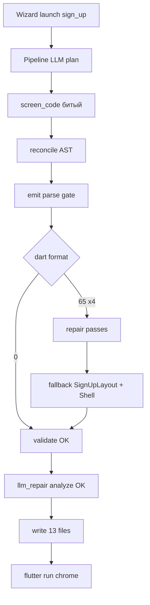

# Аннотированный лог: `figma-flutter -i`, launch `sign_up`

**Источник:** терминал `39.txt`, строки **23–823** (фрагмент от 2026-05-31 ~16:30–16:33).

**Построчная версия (каждая строка лога):** [wizard-launch-sign-up-log-line-by-line.md](./wizard-launch-sign-up-log-line-by-line.md)  
**Проект:** `E:/@dev/demo_app`  
**Итог прогона:** пайплайн **успешен** (write + `flutter run` на Chrome), но экран **не LLM-inline**, а **делегат** `GeneratedScreenShell → SignUpLayout` после emit parse gate fallback.

Нумерация ниже: **`T-N`** = строка в терминале (как в `39.txt`), **`L-N`** = строка внутри вырезки (1 = T-23).

---

## Сводка по стадиям

| Стадия | T-строки (примерно) | Результат |
|--------|---------------------|-----------|
| Wizard preamble | 23–31 | Кэш dump OK, `main.dart` на другой фиче |
| fetch → analyze | 32–51 | Кэш Figma, parse, fonts, отчёты |
| llm | 52–72 | Gemini ~44 с, IR +50 узлов (cap 40) |
| plan | 73–120 | Layout OK, `screen_code` с битыми `)` |
| emit parse gate | 121–272 | 4× `dart format` exit **65**, затем fallback |
| validate | 273–276 | Контракт codegen (shell и т.д.) — **OK** |
| llm_repair | 277–326 | analyze×3 в temp — **OK** |
| write | 349–414 | 13 файлов в `demo_app` — **OK** |
| flutter launch | 415–823 | Chrome debug — **OK** |

---

## Часть 1 — Визард до старта пайплайна (T-23 … T-31)

| Строка | Лог | Что происходит |
|--------|-----|----------------|
| **T-23** | `Run mode: launch — cached dump …` | Режим визарда: после sync сразу запуск Flutter. Figma live только если нет dump/ассетов. |
| **T-24** | `Screen: sign_up` | Целевой экран/feature. |
| **T-25** | `Dump: OK (…sign_up_layout.json)` | Сырой JSON Figma уже на диске — **fetch не ходит в API**. |
| **T-26** | `main.dart wired: sign_up_and_sign_in (mismatch)` | В `main.dart` сейчас другой экран; визард предупреждает — при write может переписать. |
| **T-27** | `Icons: 272 on disk / 20 in dump` | Иконок экспортировано больше, чем в dump; для экрана не блокер. |
| **T-28** | `Screen: sign_up` | Повтор выбора экрана перед codegen. |
| **T-29** | `Codegen: LLM screen body (fail-fast, …)` | Тело экрана от LLM; **без** отката на deterministic layout в plan (только позже gate fallback). |
| **T-30** | `Device: chrome` | `flutter run -d chrome`. |
| **T-31** | `Launching Flutter on chrome after sync…` | Сейчас пойдёт `run_pipeline`, потом launch. |

---

## Часть 2 — Pipeline: fetch → analyze (T-32 … T-51)

| Строка | Лог | Что происходит |
|--------|-----|----------------|
| **T-32** | `Generation mode: llm (llm_fallback_to_deterministic=False)` | Чистый LLM-путь для screen body. |
| **T-33** | `Pipeline run started` | Старт `run_pipeline`. |
| **T-34** | `Dev Mode CSS dump loaded: css_dump.json (9 node(s))` | Подмешан CSS из Dev Mode (9 узлов). |
| **T-35–36** | `Stage fetch started` / `Loaded cached Figma dump` | Стадия fetch; чтение `sign_up_layout.json`. |
| **T-37** | `Stage fetch completed` | Fetch готов. |
| **T-38–40** | `Stage parse` + CSS active + completed | Figma → `CleanDesignTree`, `source_override=True`. |
| **T-41–43** | `Stage fonts` completed | Шрифты (bundling/sync). |
| **T-44–45** | `Stage analyze` completed | Внутренний analyze дизайн-дерева (не `dart analyze`). |
| **T-46** | `Saved processed design tree dump` | `processed/sign_up_layout.json`. |
| **T-47–48** | AI UX report + animation manifest | Отчёты в `.debug/reports/`. |

---

## Часть 3 — LLM (T-52 … T-72)

| Строка | Лог | Что происходит |
|--------|-----|----------------|
| **T-52** | `Stage llm started` | Запрос к модели. |
| **T-53–54** | WARNING gemini + structured_output_fallback | Модель не в «рекомендованных»; JSON schema **не strict** для Google. |
| **T-55** | `Using LLM provider google … gemini-3.5-flash` | Параметры генерации. |
| **T-56** | `Attached Figma reference PNG` | В промпт PNG референс (~69 KB). |
| **T-57** | Повтор structured_output_fallback | Перед/вокруг запроса. |
| **T-58–59** | IR presence +50 nodes (cap 40) | Постобработка IR: LLM **недодал** узлы → вставили до капа; возможен раздутый emit. |
| **T-60–61** | `Stage llm completed` | Ответ LLM принят (~44 с от T-55). |

---

## Часть 4 — Plan (T-63 … T-120)

| Строка | Лог | Что происходит |
|--------|-----|----------------|
| **T-63** | `Stage plan started` | Планирование файлов + Dart. |
| **T-64–68** | Subtree widgets 1/1 | Один виджет `group6801` и т.п. |
| **T-69** | Pruned 4 decorative Vector | Убраны декоративные векторы из layout-дерева. |
| **T-70** | `generating layout file for sign_up` | Детерминированный `lib/generated/sign_up_layout.dart`. |
| **T-71** | WARNING `Unexpected ')' near line 9` | **Корень бед:** LLM `screen_code` уже с лишней `)`. |
| **T-72** | `Repaired Dart delimiters` | Первая починка скобок в `ensure_valid_llm_screen_code`. |
| **T-73–74** | Ambient background / clean-tree patch failed | Патчи по дереву **ломают** скобки снова → откат к delimiter-repaired. |
| **T-75–76** | `final planned_dart reconcile` | Финальная сверка 13 `.dart` файлов. |
| **T-77–88** | reconcile phases + AST 12.7s | Фазы cluster/dedupe/balance; AST sidecar **~2.3 s** на `sign_up_screen.dart`. |
| **T-89** | screen tree text and flex broke delimiters | Ещё один откат патча после reconcile. |
| **T-90–91** | reconcile finished / `Stage plan completed` | Plan в памяти готов; screen всё ещё может быть непарсируемым. |

---

## Часть 5 — Emit parse gate (T-121 … T-272)

Стадия **до validate/write**: временный skeleton + `dart format` на `planned` (функция `gate_planned_dart_syntax`).

| Строка | Лог | Что происходит |
|--------|-----|----------------|
| **T-121–124** | orphan_edits `main.dart`, harness | Writer сравнивает с диском: ручные правки вне `// <custom-code>`. |
| **T-125–127** | Format 13 files → **exit code 65** | **Провал parse:** formatter не смог разобрать Dart (часто `sign_up_screen.dart`). |
| **T-128–157** | orphan_edits по theme/layout/widgets/screen | Повторные предупреждения на каждой итерации gate (много файлов). |
| **T-158–162** | 2-я попытка format → **65** | Цикл repair в gate (pass 1). |
| **T-163–194** | 3-я попытка → **65** | pass 2. |
| **T-195–226** | 4-я попытка → **65** | pass 3. |
| **T-227–252** | 5-я серия orphan + format → **65** | pass 4, repair исчерпан. |
| **T-253** | **`fallback_unparseable_screens_to_layout` → SignUpLayout** | **Ключевая строка:** screen заменён на stub `GeneratedScreenShell(child: const SignUpLayout())` (+ shell class). LLM-разметка экрана **выброшена**. |
| **T-254–283** | orphan_edits после fallback | Диск/план снова сравнивается; stub проще — меньше конфликтов. |
| **T-284–288** | format → **exit code 0**, 13/13 ok | После fallback Dart **парсится**. |
| **T-289–291** | `Stage validate started/completed` | `validate_generated_dart`: Semantics, shell, textScaler и т.д. — **прошло** (shell уже в stub). |

**Коды `dart format`:** `0` = OK, `65` = есть файлы, которые не удалось отформатировать (синтаксическая ошибка).

---

## Часть 6 — llm_repair и spec23 (T-297 … T-351)

| Строка | Лог | Что происходит |
|--------|-----|----------------|
| **T-297** | `Stage llm_repair started` | Цикл analyze → optional LLM fix (здесь analyze чистый). |
| **T-298–300** | WARNING gemini / schema | Те же предупреждения провайдера. |
| **T-301** | repair model gemini-3.5-flash | Модель для repair-ветки. |
| **T-302–305** | orphan_edits main/harness | Перед записью в temp workspace. |
| **T-306–313** | format OK, pub get offline, analyze OK | Проверка в **временной** папке. |
| **T-314–327** | format + analyze **(1/3)(2/3)(3/3)** OK | Spec23: тройной `dart analyze` для стабильности. |
| **T-328–330** | skip pub get (unchanged) | Кэш зависимостей в temp. |
| **T-331–332** | `llm_repair completed` | Repair-стадия без LLM-правок. |
| **T-333–335** | visual_refine skipped | Пиксельный refine выключен. |
| **T-336** | debug bundle `sign_up_screen.dart` | Копия итогового screen в `.debug/dart/`. |

---

## Часть 7 — Write в demo_app (T-349 … T-414)

| Строка | Лог | Что происходит |
|--------|-----|----------------|
| **T-349** | `Stage write started` | Запись 13 файлов в `E:\@dev\demo_app`. |
| **T-350–356** | orphan_edits + format OK | Pre-write format в проекте. |
| **T-357–374** | orphan_edits theme/layout/screen | Предупреждения о ручных правках; **не блокируют** write. |
| **T-375–378** | format перед analyze в проекте | |
| **T-379–398** | screen stub imports layout + app_layout | Уже видно **делегат**, не LLM-дерево виджетов. |
| **T-399** | main.dart → `sign_up_and_sign_in` в preview | Старый import в превью строки; позже может обновиться. |
| **T-400–404** | format + pub get + analyze ×3 | Финальная валидация **на реальном проекте**. |
| **T-405** | `dart analyze (generated) passed` | Write разрешён. |
| **T-406–407** | `Write stage complete with 13 files` | Файлы на диске. |

---

## Часть 8 — Wizard после пайплайна + Flutter (T-415 … T-823)

| Строка | Лог | Что происходит |
|--------|-----|----------------|
| **T-415** | No FILL-sized nodes | Мягкое предупреждение responsive/constraints. |
| **T-416** | No prototype navigation links | Нет Figma prototype links → нет навигации. |
| **T-417** | **delegates to SignUpLayout** | Визард явно: итог **как deterministic**, не уникальный LLM UI в screen. |
| **T-418** | `Generated screen sign_up via cached dump` | Успех генерации с кэшем. |
| **T-419–421** | `flutter pub get` + Got dependencies | Зависимости demo_app. |
| **T-422** | `Launching flutter run on chrome` | Старт dev-сервера. |
| **T-423–424** | Waiting for connection… 22.8s | Сборка web + Chrome. |
| **T-425–431** | Hot reload / quit keys | Интерактив `flutter run`. |
| **T-432–437** | VM Service + DevTools URLs | Debug подключён — **приложение живое**. |
| **T-438+** | `Starting` (обрезано) | Дальше лог Flutter framework. |

---

## Повторяющиеся WARNING (кратко)

### `_guard_orphan_edits` (десятки строк, T-121 … T-403)

**Смысл:** при merge существующего файла на диске найдены изменения **вне** зон `// <custom-code>` / auto-generated. Регенерация может их затереть.  
**Не ошибка:** INFO/WARNING, write не останавливает.  
**Часто видно:** двойные `;;` в preview — артефакт старых правок или formatter.

### `structured_output_fallback` / gemini not recommended

**Смысл:** для Google JSON schema в режиме non-strict; возможны отличия от OpenAI strict.  
**Связь с битыми `)`:** косвенная (модель + пост-патчи), не прямой отказ API.

---

## Диаграмма потока (этот прогон)

---

## Что смотреть в следующий раз

1. **T-71** — первый симптом: LLM `screen_code` невалиден.  
2. **T-127, 162, 194, 226** — `exit code 65` до fallback.  
3. **T-253** — момент замены на layout delegate.  
4. **T-417** — подтверждение, что в UI уйдёт `SignUpLayout`, а не inline LLM.  
5. **T-406** — write прошёл; смотреть `lib/features/sign_up/sign_up_screen.dart` — ожидаемо короткий shell + import layout.

---

## Связанные файлы в репозитории

| Механизм | Модуль |
|----------|--------|
| Emit parse gate | `generator/validation.py` → `gate_planned_dart_syntax` |
| Fallback screen | `generator/planned_dart.py` → `fallback_unparseable_screens_to_layout` |
| Sanitize Text/copyWith | `generator/dart_syntax_repairs.py` → `merge_orphaned_text_style_params_after_close` |
| Validate shell | `generator/codegen_checks.py` |
| Wizard launch | `dev/wizard.py`, `cli_interactive.py` |

---

*Документ сгенерирован для разбора инцидента emit/validate/write; при смене модели или отключении LLM screen body картина может отличаться.*
