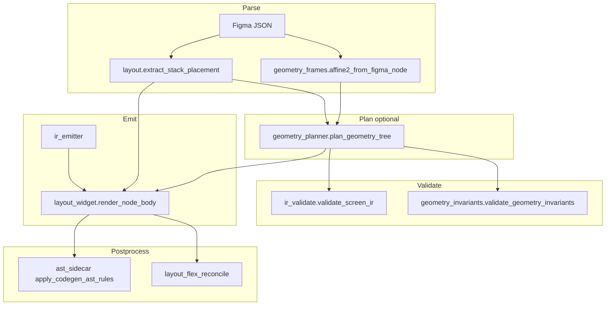

# Systemic Core Audit — Figma → Flutter Compiler

**Mode:** read-only architectural research (no code changes in this deliverable).  
**Scope:** `parser/`, `generator/`, `tools/dart_ast_sidecar/`, AST client `tools/ast_sidecar.py`.  
**Goal:** universal invariants for Living Production (10k+ arbitrary enterprise screens) without screen-specific patching.

**Related:** prior calibration notes (matrix double-translate, SignUp layout) are folded into `SYS-CORE-001`–`004`. A separate theory doc (`docs/universal-translation-theory.md`) is **not present in the workspace git tree** at audit time; this file is the canonical systemic audit artifact.

---

## 1. Fundamental architectural diagnosis

1. **Pixel truth is cascade-first when planner is on.** Production emit runs the geometry planner (`use_geometry_planner: true` by default in [`config.py`](src/figma_flutter_agent/config.py)) before deterministic layout: `layout_slot`, `compose_affine`, and T1–T5 invariants via [`normalize_clean_tree`](src/figma_flutter_agent/generator/normalize.py). Legacy [`_apply_node_transform`](src/figma_flutter_agent/generator/layout_widget.py) remains as fallback when planner is off.

2. **Affine information is lossy on the legacy path.** [`transform_context_from_figma_node`](src/figma_flutter_agent/parser/geometry.py) decomposes `relativeTransform` with `atan2` + `hypot`, collapsing reflection (det &lt; 0) and conflating shear with rotation. The planner path preserves full `Affine2` via [`affine2_from_figma_node`](src/figma_flutter_agent/parser/geometry_frames.py), but emit still uses `Alignment.center` in [`matrix4_linear_expr`](src/figma_flutter_agent/generator/geometry_affine.py) while pins are top-left—pivot impedance.

3. **Translation is not a single channel.** Under the planner, `local.tx/ty` flow into `placement_origin`, `positioned_pins`, and optionally `residual_matrix` (linear only). [`_ensure_positioned_stack_bounds`](src/figma_flutter_agent/generator/layout_widget.py) may still pin width/height from AABB while linear `Matrix4` rotates about center—classic double-application drift on deep STACK × Auto Layout × GROUP mirrors.

4. **Two fidelity metrics without mandatory closure.** Geometric tiering ([`validation/geometry_metrics.py`](src/figma_flutter_agent/validation/geometry_metrics.py): IoU/GIoU/DIoU) and raster diff ([`validation/pixeldiff.py`](src/figma_flutter_agent/validation/pixeldiff.py)) are not wired as a single gate on the deterministic path. Visual refine is **disabled** when `use_deterministic_screen` ([`stages/visual_refine.py`](src/figma_flutter_agent/stages/visual_refine.py) `_should_run_visual_refine`), so layout-only drift has no pixel closed loop.

5. **Elasticity is local, not contractual.** INPUT padding is partially modeled ([`geometry_flex.compute_input_metrics`](src/figma_flutter_agent/generator/geometry_flex.py), [`_input_content_padding`](src/figma_flutter_agent/generator/layout_widget.py)), but most TEXT/INPUT/BUTTON nodes still receive fixed `SizedBox` / `Positioned` height from Figma bbox. [`layout_flex_reconcile`](src/figma_flutter_agent/generator/layout_flex_reconcile.py) skips nodes with `stack_placement`, so flex children that remain absolutely placed never get AST/tree flex guards.

6. **Variants are prop-level, not topology-level.** [`variant_props`](src/figma_flutter_agent/generator/variant_props.py) and [`ir_states`](src/figma_flutter_agent/generator/ir_states.py) map Figma component properties to Material flags and `WidgetIrOverrides`. [`cluster_variants`](src/figma_flutter_agent/generator/cluster_variants.py) handles mirrored vector assets only—not subgraph replacement (e.g. Text → `CircularProgressIndicator`). Re-import risks constructor/signature drift vs handwritten `// <custom-code>` zones.

7. **Z-order is triangulated, not unified.** [`overlap_sweep.demote_overlapping_occluders`](src/figma_flutter_agent/parser/overlap_sweep.py), [`stack_paint`](src/figma_flutter_agent/parser/stack_paint.py) viewport-ratio heuristics, and IR [`_validate_stack_ghost_occlusion`](src/figma_flutter_agent/generator/ir_validate.py) / planner T5 ([`geometry_invariants`](src/figma_flutter_agent/generator/geometry_invariants.py)) can disagree on who paints above whom.

8. **Postprocess is size-bimodal.** At 80 000 UTF-8 bytes ([`AST_SIDECAR_MAX_SOURCE_BYTES`](src/figma_flutter_agent/tools/ast_sidecar.py)): layout rules may run **chunked** by `ValueKey('figma-…')`, but **`codegen_pass` is skipped entirely** (no text scaler, no flex wrap, no import/unscale fixes). [`dart_postprocess._run_rules`](src/figma_flutter_agent/generator/dart_postprocess.py) and [`dart_syntax_repairs._apply_via_sidecar`](src/figma_flutter_agent/generator/dart_syntax_repairs.py) become no-ops; only regex fallbacks (e.g. `inline_orphan_text_scaler_refs`) remain.

9. **IR and deterministic emit share one body renderer.** [`ir_emitter`](src/figma_flutter_agent/generator/ir_emitter.py) delegates to `render_node_body`—IR does not introduce a separate transform algebra; IR validate guards structure but cannot fix emit-time pivot bugs (INV-T4 gap).

10. **`layout_rect` for transformed nodes uses local origin + local size.** [`hydrate_geometry_frame`](src/figma_flutter_agent/parser/geometry_frames.py) sets transformed `intrinsic_size` from Figma `size` (or numerical AABB recovery), not world AABB width/height—closing second-order reproject drift on rotated nodes.

---

## 2. Registry of systemic conceptual gaps (`SYS-CORE-###`)

### Direction A — Matrix cascade

#### SYS-CORE-001
- **Direction:** Matrix cascade  
- **Leaky abstraction:** Two geometry pipelines (legacy AABB + polar transform vs planner `Affine2` cascade) selected by a single boolean; emit does not branch on a unified `CascadeContext`.  
- **Trigger @10k:** Same product toggles `use_geometry_planner` or mixes screens parsed before/after planner rollout.  
- **Files:** [`config.py`](src/figma_flutter_agent/config.py) `GenerationSettings.use_geometry_planner`; [`normalize.py`](src/figma_flutter_agent/generator/normalize.py) `normalize_clean_tree`; [`layout_renderer.py`](src/figma_flutter_agent/generator/layout_renderer.py) `render_layout_file`  
- **Fix concept:** Single post-parse `CascadeContext` per node; planner becomes the only mutator of `layout_slot`; legacy path is a deprecated adapter until default-on.

#### SYS-CORE-002
- **Direction:** Matrix cascade  
- **Leaky abstraction:** `hypot(a,b)` scale is always non-negative → mirror/flip in GROUP/VECTOR loses sign of det.  
- **Trigger @10k:** Mirrored icon groups, RTL chrome, flipped export pairs inside STACK.  
- **Files:** [`parser/geometry.py`](src/figma_flutter_agent/parser/geometry.py) `transform_context_from_figma_node`  
- **Fix concept:** Use `Affine2` linear block everywhere; if `det(A) < 0`, route to raster/boundary tier (`requires_raster_tier`) and forbid `Transform.rotate` shortcut.

#### SYS-CORE-003
- **Direction:** Matrix cascade  
- **Leaky abstraction:** `matrix4_linear_expr` uses `alignment: Alignment.center` while stack placement pins top-left of AABB.  
- **Trigger @10k:** Rotated VECTOR/INSTANCE inside scaled FRAME with absolute children.  
- **Files:** [`geometry_affine.py`](src/figma_flutter_agent/generator/geometry_affine.py) `matrix4_linear_expr`; [`layout_widget.py`](src/figma_flutter_agent/generator/layout_widget.py) `_apply_node_transform`  
- **Fix concept:** Pivot invariant: linear Matrix4 must use `Alignment.topLeft` **or** pre-translate by `(w/2, h/2)` in the same channel as `Positioned`, never both AABB translate and matrix translate.

#### SYS-CORE-004
- **Direction:** Matrix cascade  
- **Leaky abstraction:** Planner stores translation in `placement_origin` / `positioned_pins` and rotation in `residual_matrix`, but legacy rotate path still runs when `slot.residual_matrix` is None.  
- **Trigger @10k:** Child with non-axis-aligned `local_transform` under STACK parent with `stack_placement` width/height pins.  
- **Files:** [`geometry_planner.py`](src/figma_flutter_agent/generator/geometry_planner.py) `_residual_matrix`, `_stack_pins_from_placement`; [`layout_widget.py`](src/figma_flutter_agent/generator/layout_widget.py) `_apply_node_transform`, `_ensure_positioned_stack_bounds`  
- **Fix concept:** T4 channel separation: if `positioned_pins` has `(left, top)`, `residual_matrix` is strictly linear and `expand_aabb(world, intrinsic) ≈ parsed_world_aabb`.

#### SYS-CORE-005
- **Direction:** Matrix cascade  
- **Leaky abstraction:** T2 `extent_conservation_error` sums flex child `slot_rect` spans along ROW/COLUMN—semantic mismatch when children are STACK-absolutely positioned.  
- **Trigger @10k:** STACK screens misclassified as FLEX backend or wide absolute children inside COLUMN.  
- **Files:** [`geometry_invariants.py`](src/figma_flutter_agent/generator/geometry_invariants.py) `_check_t2_flex_conservation`; [`geometry_planner.py`](src/figma_flutter_agent/generator/geometry_planner.py) `extent_conservation_error`  
- **Fix concept:** Apply T2 only when `layout_slot.backend == FLEX` **and** child has no `stack_placement`; STACK uses pin closure (T1) only. Confirmed by [`tests/test_geometry_invariants.py`](tests/test_geometry_invariants.py) `test_t2_conservation_skips_stack`.

#### SYS-CORE-017
- **Direction:** Matrix cascade  
- **Leaky abstraction:** `layout_rect` uses `(local.tx, local.ty)` as rectangle origin.  
- **Trigger @10k:** Any rotated node with non-zero `relativeTransform` translation.  
- **Files:** [`parser/geometry_frames.py`](src/figma_flutter_agent/parser/geometry_frames.py) `hydrate_geometry_frame`  
- **Fix concept:** `layout_rect` origin = corner of axis-aligned **placement** box (from `placement_aabb` or `expand_aabb(local, intrinsic)`), not raw matrix entries.

---

### Direction B — Elastic constraints

#### SYS-CORE-006
- **Direction:** Elasticity  
- **Leaky abstraction:** Flex reconcile skips any node with `stack_placement`, assuming stack children need no flex wraps—even when parent is ROW/COLUMN.  
- **Trigger @10k:** Auto-layout row with `layoutPositioning: ABSOLUTE` children (common in forms).  
- **Files:** [`layout_flex_reconcile.py`](src/figma_flutter_agent/generator/layout_flex_reconcile.py) `apply_flex_guards_from_tree` (lines 116–118)  
- **Fix concept:** Skip only when parent is STACK (or `layout_slot.backend == STACK`), not merely when child has placement record.

#### SYS-CORE-007
- **Direction:** Elasticity  
- **Leaky abstraction:** `GEOMETRY_PLANNER_MARKER` disables AST flex pass entirely; only `_apply_planner_wraps` runs.  
- **Trigger @10k:** Enterprise forms with planner on—missing `wrap_flex_row_column_children` recovery.  
- **Files:** [`layout_flex_reconcile.py`](src/figma_flutter_agent/generator/layout_flex_reconcile.py) `apply_flex_guards_from_tree`; [`tests/test_geometry_planner_emit.py`](tests/test_geometry_planner_emit.py) `test_flex_reconcile_skips_ast_when_geometry_planner_marker_present`  
- **Fix concept:** Planner emits authoritative `layout_slot.wraps`; reconcile should verify emit, not skip AST blindly—or AST rules become idempotent validators only.

#### SYS-CORE-008
- **Direction:** Elasticity  
- **Leaky abstraction:** `_flex_child_should_bind_fixed_height` and `SizedBox` wrapping bind Figma frame height even when content is dynamic (`_is_form_field_group_column` is an exception, not the rule).  
- **Trigger @10k:** Localized copy, API-driven labels, multi-line error text under INPUT.  
- **Files:** [`layout_flex_policy.py`](src/figma_flutter_agent/generator/layout_flex_policy.py) `_flex_child_should_bind_fixed_height`, `apply_flex_wrap_to_widget`; [`layout_widget.py`](src/figma_flutter_agent/generator/layout_widget.py) `_node_layout_size`  
- **Fix concept:** Elastic IR fields `minHeight`, `maxHeight`, `heightFit: fixed|min|intrinsic` derived from glyph metrics + line count; emit `BoxConstraints` not fixed height for TEXT/INPUT in scroll/flex.

#### SYS-CORE-009
- **Direction:** Elasticity  
- **Leaky abstraction:** `resolve_line_height` produces static ratio; no validation against `TextScaler` &gt; 1.0 at compile time.  
- **Trigger @10k:** Accessibility large text on dense auth/onboarding screens.  
- **Files:** [`parser/text_line_height.py`](src/figma_flutter_agent/parser/text_line_height.py) `resolve_line_height`; [`dart_postprocess.py`](src/figma_flutter_agent/generator/dart_postprocess.py) `ensure_text_scaler_support`  
- **Fix concept:** INV-A11Y: simulate `textScaler ∈ {1.0, 1.3, 2.0}` on IR bounding boxes before emit; increase `maxHeight` slack proportionally to ratio.

#### SYS-CORE-018
- **Direction:** Elasticity  
- **Leaky abstraction:** `compute_input_metrics` runs in planner path only; default path uses heuristic `_input_content_padding` without shared `TextMetricsFrame` contract.  
- **Trigger @10k:** INPUT in COLUMN with FILL width and static 46px frame height.  
- **Files:** [`geometry_flex.py`](src/figma_flutter_agent/generator/geometry_flex.py) `compute_input_metrics`; [`layout_widget.py`](src/figma_flutter_agent/generator/layout_widget.py) `_input_content_padding`, `_flex_input_content_padding`  
- **Fix concept:** Always attach `TextMetricsFrame` at parse for INPUT; emit padding from metrics on both paths. Covered partially by [`tests/test_input_content_padding.py`](tests/test_input_content_padding.py).

---

### Direction C — Variant combinatorics

#### SYS-CORE-010
- **Direction:** Variants  
- **Leaky abstraction:** `ClusterVectorVariant` parameterizes asset choice (`isForward`), not layer topology.  
- **Trigger @10k:** Component set where `State=Loading` replaces label subtree with spinner.  
- **Files:** [`cluster_variants.py`](src/figma_flutter_agent/generator/cluster_variants.py) `detect_vector_flip_variant`, `collect_cluster_vector_variants`  
- **Fix concept:** Structural signature hash per variant instance; if Jaccard(subtree types) &lt; θ, emit separate `WidgetConfig` branch or slot-based builder.

#### SYS-CORE-011
- **Direction:** Variants  
- **Leaky abstraction:** `apply_adaptive_rules_to_ir` merges `WidgetIrOverrides` only—cannot hide/show arbitrary subtrees.  
- **Trigger @10k:** ×4 states × icon positions → LLM or emitter flattens to nested conditionals in one `build()`.  
- **Files:** [`ir_states.py`](src/figma_flutter_agent/generator/ir_states.py) `apply_adaptive_rules_to_ir`, `enrich_screen_ir_states`  
- **Fix concept:** `ComponentConfig` with `visibility: Set<FigmaId>` and stable slot API; overrides become declarative config objects, not duplicated widget trees.

#### SYS-CORE-012
- **Direction:** Variants  
- **Leaky abstraction:** State templates (`state_riverpod.dart.j2`, etc.) emit placeholder `StateProvider<bool>` unrelated to Figma variant axes.  
- **Trigger @10k:** Re-import changes generated provider API → breaks handwritten listeners.  
- **Files:** [`generator/templates/state_riverpod.dart.j2`](src/figma_flutter_agent/generator/templates/state_riverpod.dart.j2); [`planned_dart.py`](src/figma_flutter_agent/generator/planned_dart.py) `reconcile_cluster_variant_args`  
- **Fix concept:** Generated state = immutable `freezed` config types keyed by component property schema; public ctor params frozen across sync.

#### SYS-CORE-019
- **Direction:** Variants  
- **Leaky abstraction:** `reconcile_cluster_variant_args` strips call-site args when widget files lack parameters—silent signature repair hides drift.  
- **Trigger @10k:** Cluster widget regen after designer adds variant axis.  
- **Files:** [`planned_dart.py`](src/figma_flutter_agent/generator/planned_dart.py) `reconcile_cluster_variant_args`  
- **Fix concept:** Fail validation when cluster param schema changes vs call sites; require explicit migration in `// <custom-code>` zones.

---

### Direction Gates — AST 80KB

#### SYS-CORE-013
- **Direction:** Size gates  
- **Leaky abstraction:** [`dart_postprocess._run_rules`](src/figma_flutter_agent/generator/dart_postprocess.py) returns source unchanged when oversized—per-rule repairs never run.  
- **Trigger @10k:** Single `*_layout.dart` &gt; 80KB (dense STACK screens).  
- **Files:** `dart_postprocess.py` `_run_rules`; `ast_sidecar.py` `ast_source_exceeds_sidecar_limit`  
- **Fix concept:** Route all postprocess through chunked sidecar or subtree file split at plan time.

#### SYS-CORE-014
- **Direction:** Size gates  
- **Leaky abstraction:** `apply_flex_guards_from_tree` returns early with warning—no tree-level fallback.  
- **Trigger @10k:** Same monolithic layout file.  
- **Files:** [`layout_flex_reconcile.py`](src/figma_flutter_agent/generator/layout_flex_reconcile.py) `apply_flex_guards_from_tree`  
- **Fix concept:** Per-figma-id `extract_widget` + wrap pass (already used elsewhere) for flex guards.

#### SYS-CORE-015
- **Direction:** Size gates  
- **Leaky abstraction:** `ensure_text_scaler_support` falls back to regex `inline_orphan_text_scaler_refs` without AST layout context.  
- **Trigger @10k:** Oversized layout + a11y text scaling.  
- **Files:** [`dart_postprocess.py`](src/figma_flutter_agent/generator/dart_postprocess.py) `ensure_text_scaler_support`, `inline_orphan_text_scaler_refs`  
- **Fix concept:** Chunked `ensureTextScalerSupport` in sidecar per subtree; forbid regex-only path when `use_ast_sidecar: true`.

#### SYS-CORE-016
- **Direction:** Size gates  
- **Leaky abstraction:** `apply_codegen_ast_rules` skips full `codegen_pass` when oversized (explicit comment: chunked codegen can corrupt responsive shells).  
- **Trigger @10k:** Large deterministic layout after planner marker.  
- **Files:** [`ast_sidecar.py`](src/figma_flutter_agent/tools/ast_sidecar.py) `apply_codegen_ast_rules`; [`tools/dart_ast_sidecar/lib/rules_codegen.dart`](tools/dart_ast_sidecar/lib/rules_codegen.dart) `applyCodegenPass`  
- **Lost transforms when skipped:** `strip_bare_unicode_escapes`, `normalize_string_literals`, `sanitize_imports`, `unscale_design_expressions`, `unwrap_scale_layout_builder`, `strip_viewport_scale_transform`, `fix_llm_api_mistakes`, `strip_design_canvas_gesture_matryoshka`, `wrap_flex_row_column_children`, `llm_syntax_repairs`, `ensure_text_scaler`.  
- **Fix concept:** Split responsive shell from leaf widgets at plan time; run `codegen_pass` on chunks &lt; 80KB; staged limit 80→200→500KB with perf budget.

#### SYS-CORE-020
- **Direction:** Size gates  
- **Leaky abstraction:** `apply_llm_dart_syntax_repairs` → `_apply_via_sidecar` no-op when &gt; 80KB; writer still calls it.  
- **Trigger @10k:** LLM screen path on large files.  
- **Files:** [`dart_syntax_repairs.py`](src/figma_flutter_agent/generator/dart_syntax_repairs.py) `apply_llm_dart_syntax_repairs`; [`writer.py`](src/figma_flutter_agent/generator/writer.py)  
- **Fix concept:** Same chunked AST policy as layout rules; telemetry flag `regex_fallback_used` in CI.

**Note:** `apply_ast_rules` for `_LAYOUT_RULES` **does** attempt chunked pass by figma `ValueKey` when oversized ([`ast_sidecar.py`](src/figma_flutter_agent/tools/ast_sidecar.py) `_apply_rules_chunked_by_figma_keys`)—partial mitigation for SYS-CORE-013, not for codegen.

---

## 3. Mathematical invariant matrix (`ir_validate.py`)

| ID | Law | Predicate (must hold before Dart emit) | Status |
|----|-----|----------------------------------------|--------|
| INV-T1 | Pin closure | After `round_stack_placement`, reproject world AABB from `world_transform ⊗ intrinsic` within ε = `geom_epsilon()` | **Implemented** — `geometry_invariants._check_t1_reproject`, `_check_t1_placement`; local intrinsic from `size` for transformed nodes |
| INV-T2 | Flex extent | For `backend=FLEX` ROW/COLUMN only: Σ child spans + gaps ≈ parent span after axis-prefix rounding | **Partial** — `_check_t2_flex_conservation`; skipped for STACK children (test) |
| INV-T3 | Baseline / strut | `delta_top` ⇒ `WrapKind.DELTA_TOP_PADDING` or INPUT `input_padding_top` | **Partial / accepted-approximate** — `_check_t3_baseline`; `flutter_baseline_offset` + font_family table is heuristic; `baseline_verifiable=False` for INPUT until real font metrics or golden loop |
| INV-T4 | Affine channel | If `positioned_pins.left/top` set ⇒ `residual_matrix` has zero translation; no `Matrix4.translate` in emit | **Gap** — not validated on emitted Dart |
| INV-T5 | Paint order | Presentational ⊄ above interactive on overlap; static runs partition interactives | **Partial** — IR `_validate_stack_ghost_occlusion`; planner `_check_t5_*` |
| INV-E1 | Elastic headroom | `minHeight ≤ figmaHeight ≤ maxHeight` with `maxHeight - minHeight ≥ slack(lineHeight, a11y)` | **Missing** |
| INV-E2 | Flex stretch bound | `CrossAxisAlignment.stretch` ⇒ parent bounded on cross axis | **Partial** — `layout_flex_policy._resolve_*_cross_axis`; IR `_validate_flex_child_slot` for scroll hosts only |
| INV-A11Y | Text scale | No overflow at `textScaler` 1.3 and 2.0 for TEXT/INPUT subtrees | **Missing** (runtime AST optional) |
| INV-V1 | Variant topology | If variant pair Δtopology &gt; θ ⇒ no merged single `WidgetIrNode` subtree | **Missing** |
| INV-Z | Z DAG | Single total order consistent with overlap sweep + interaction class | **Partial** — mixed-stack positioned-only Z-sort (ROB-05); three subsystems remain |
| INV-CONSTRAINT-NORMAL | BoxConstraints | `maxHeight >= minHeight` on INPUT `layout_slot` and emit | **Implemented** — `geometry_planner`, `normalize_box_constraints`, `_check_constraint_normal` |
| INV-IDENT-SAFE | ValueKey / type names | Figma ids and Dart class names whitelist-sanitized at emit | **Implemented** — `sanitize_figma_key_token`, `sanitize_dart_type_name` (ROB-02/10) |
| INV-TRANSFORM-VALID | Parse boundary | Malformed `relativeTransform` → `ParseError`; absent matrix → identity | **Implemented** — `affine2_from_figma_node` (ROB-03) |
| INV-LOG-SAFE | Error logging | Dart analyze log write never crashes repair loop | **Implemented** — `dart_error_log._coerce_log_payload` (ROB-08) |
| INV-UNIQUE-ID | Clean tree | Duplicate Figma node ids fail before IR merge | **Implemented** — `validate_unique_node_ids` (ROB-09) |

**Recommended hook:** extend [`validate_screen_ir`](src/figma_flutter_agent/generator/ir_validate.py) to call `validate_geometry_invariants` always when `layout_slot` present; add INV-T4 emit-time static check via sidecar snippet analyzer; add INV-E1/A11Y/V1 as IR schema constraints.

### ROB-09..11 verification (fail-fast backlog)

| ID | Status | Finding |
|----|--------|---------|
| **ROB-09** | **Closed** | `index_clean_tree` silently overwrote duplicate ids; now `validate_unique_node_ids` runs at normalize + index boundaries. |
| **ROB-10** | **Closed** | `to_pascal_case` could emit invalid class names (`123Foo`, Dart keywords); `sanitize_dart_type_name` applied via `to_pascal_case`. |
| **ROB-11** | **Documented** | Clean tree is **copy-on-write** (`model_copy` / `deep_copy_clean_tree`); parser passes replace subtrees rather than mutating shared references in place. |

---

## 4. Ranked systemic refactor roadmap

### P0 — Pipeline safety (cascade unification)

1. Introduce `CascadeContext` on every node at parse (`world`, `local`, `placementChannel`, `pivot`).  
2. Implement INV-T4 in `ir_validate` + planner-only emit path behind flag; fix pivot (`topLeft` vs center).  
3. Default-off → staged default-on `use_geometry_planner` with fixtures: nested transform depth ≥ 3 ([`tests/fixtures/layouts/*.json`](tests/fixtures/layouts)).  
4. Deprecate `TransformContext` polar path for emit; keep only for diagnostics.

**Verify:** `tests/test_geometry_invariants.py`, `tests/test_geometry_planner_emit.py`, new fixture `nested_affine_cascade.json`.

### P1 — Production elasticity

1. Parse-time `ElasticBounds` on TEXT/INPUT/BUTTON (`minHeight`, `maxHeight`, padding deltas).  
2. INV-E1 + INV-A11Y in `ir_validate`.  
3. Fix `apply_flex_guards_from_tree` parent-type guard (SYS-CORE-006).  
4. Unify INPUT metrics: always `TextMetricsFrame` (SYS-CORE-018).

**Verify:** `tests/test_input_content_padding.py`, `tests/test_layout_flex_policy.py`, new `test_elastic_bounds_a11y.py`.

### P2 — Variants as configuration

1. Structural diff between component instances (typed subtree Jaccard).  
2. `ComponentConfig` emit + stable ctor contract; wire [`custom_code_zones`](src/figma_flutter_agent/generator/custom_code_zones.py) `figma-{id}`.  
3. Replace bool `StateProvider` templates with schema-driven immutable config.  
4. Fail on `reconcile_cluster_variant_args` silent strip (SYS-CORE-019).

### P3 — Size gates to 500KB

1. Plan-time split: shell vs subtrees (&lt; 80KB each).  
2. Chunked `codegen_pass` with integration tests (no responsive shell corruption).  
3. Chunked flex + text scaler passes.  
4. Raise `AST_SIDECAR_MAX_SOURCE_BYTES` in stages (80→200→500) with Windows perf budget; log when regex fallback used.

### P4 — Closed-loop fidelity

1. Deterministic CI: geometry tier gate via `geometry_metrics` on fixtures.  
2. Optional layout-only pixel refine submodule (decoupled from LLM screen IR).  
3. Unify Z-order into one DAG pass before emit.

---

## Appendix A — Matrix4 Cascade Execution (target spec)

For each node `n` with parent `p`:

- `W_n = W_p · L_n` where `L_n` is `Affine2` from `relativeTransform` (no polar decomposition).  
- **Placement channel:**  
  - `STACK` / absolute: `pins = AABB(parent, n) - AABB(parent)` rounded (T1).  
  - `FLEX`: flex slot rects from layout modes (T2).  
- **Emit:**  
  - `Positioned(left: pins.left, top: pins.top, …)` carries translation.  
  - `Transform` carries `L_n'` where `L_n' = linear(L_n)` only.  
  - **Pivot:** `Alignment.topLeft` for linear matrix **or** explicit centering translate derived from `intrinsic` size, matching Figma rotation origin.  
- **If `det(linear(L_n)) < 0` or shear:** `LayoutBackend.BOUNDARY` → raster/SVG/custom paint; no `Transform.rotate` shortcut.

---

## Appendix B — Elastic Constraints (target algorithm)

For control node `n` with Figma height `H`, font size `s`, line ratio `r`:

- `glyphH = s * 0.72` (or measured `glyph_height`)  
- `lineBox = s * r`  
- `paddingTop = max(0, glyphTop - leading(s,r))`  
- `minHeight = H`  
- `maxHeight = minHeight + max(k * s * (a11yScale - 1), multilineSlack)`  
- Emit `BoxConstraints(minHeight: …, maxHeight: …)` or `InputDecoration.contentPadding` deltas—not fixed outer `SizedBox(height: H)` when parent is scroll/flex.

**Flex:** `stretch` allowed iff parent supplies finite cross-axis max (link INV-T2 and INV-E2).

---

## Appendix C — Parametric variants (`ComponentConfig`)

```
ComponentConfig {
  clusterId: string
  props: Map<String, Object>      // Type, State, Size, Icon…
  visibility: Set<FigmaId>        // nodes absent in this variant
  slots: Map<SlotId, WidgetRef>   // stable slot API
}
```

- **Structural diff:** `sig(v) = multiset(NodeType, depth, childCount)` per variant; if `Jaccard(sig(v1), sig(v2)) < 0.85` → separate branch configs, not one merged tree.  
- **Signature protection:** public widget ctor params frozen; changes require new optional named params with defaults.  
- **Custom code:** `// <custom-code:figma-{id}>` blocks never removed on sync ([`writer.py`](src/figma_flutter_agent/generator/writer.py) smart indent rebase).

---

## Appendix D — Size gates: losses and 500KB procedure

| Pass | &gt; 80KB behavior | Lost capability |
|------|-------------------|-----------------|
| `apply_codegen_ast_rules` | Skip entirely | Full [`applyCodegenPass`](tools/dart_ast_sidecar/lib/rules_codegen.dart) |
| `dart_postprocess._run_rules` | Identity | Per-rule AST fixes |
| `apply_flex_guards_from_tree` | Early return | Flex wrap reconciliation |
| `apply_llm_dart_syntax_repairs` | Identity | LLM syntax repairs |
| `apply_ast_rules` (_LAYOUT_RULES_) | Chunked by figma id | Only if per-snippet &lt; 80KB |
| `ensure_text_scaler_support` | Regex fallback | Context-aware scaler insertion |

**500KB procedure (procedural, no code here):**

1. **Plan split:** `planned_dart` emits `feature_layout_shell.dart` + `feature_layout_body_*.dart` by cluster/subtree size budget.  
2. **Chunked AnalysisDriver:** parse units per file; cache `CompilationUnit` per chunk.  
3. **Incremental rules:** run `codegen_pass` per chunk; never on full 500KB single compilation unit.  
4. **Perf gate:** p95 sidecar latency &lt; T on Windows CI before raising cap.  
5. **Telemetry:** CI fails if `regex_fallback_used` without waiver.

---

## 3. Geometry invariant severity matrix (WP-P1)

Production gate in [`geometry/invariants.py`](../src/figma_flutter_agent/generator/geometry/invariants.py) partitions violations into **HARD** (fail-closed `GenerationError`) and **SOFT** (log + `layout_slot.degraded` + telemetry).

| Severity | Codes | Rationale |
|----------|-------|-----------|
| **HARD** | `constraint_normal`, `inv_unit`, `inv_emit_no_translate`, `inv_affine_det`, `inv_flex_axis`, `missing_layout_slot`, `inv_z` | Runtime assert, dead UI, or structural emit corruption |
| **SOFT** | `t1_reproject`, `inv_reproject`, `t1_placement_origin`, `t1_placement_aabb_width`, `t2_flex_conservation`, `t3_baseline_delta`, `t5_repaint_partition` | Sub-pixel drift within ε budget |
| **Context** | `inv_ast_coverage` | HARD when `generation.strict_geometry_invariants` (production profile); SOFT otherwise |

**Epsilon SSOT:** `geom_epsilon()`, `_T2_OVERFLOW_TOLERANCE = 0.5`, `_BASELINE_EPSILON = 0.5`.

**Call sites:** `normalize_clean_tree`, `planner.py` (post-emit + AST skip), `ir/validate.py`.

**Corpus gate:** `tests/test_layout_fixture_invariants.py`, `tests/test_planner_corpus_gate.py` — 0 HARD on all fixture classes.

---

## Appendix E — Cross-validation (tests ↔ SYS-CORE)

| SYS-CORE | Test / fixture evidence |
|----------|-------------------------|
| 001, 004 | `tests/test_geometry_planner_emit.py`, `tests/test_geometry_invariants.py` |
| 005 | `test_t2_conservation_skips_stack` |
| 006, 007 | `test_flex_reconcile_skips_ast_when_geometry_planner_marker_present`; `tests/test_layout_flex_policy.py` |
| 008, 018 | `tests/test_input_content_padding.py` |
| 009 | `tests/test_layout_text_web_safety.py` (if present); gap for scaler 2.0 |
| 010 | No topology variant test — **gap** |
| 013–016 | `tests/test_dart_postprocess.py`, `tests/test_ast_sidecar_retry.py` (partial) |
| Fixtures | `tests/fixtures/layouts/sign_up_and_sign_in_layout.json`, `music_v2_layout.json`, `reminders_layout.json` — integration targets for P0/P1, not unit proofs per SYS-CORE |

---

## As-Is data-flow reference



---

*Audit completed: read-only pass over repository state. Implementation tracked in §4 P0–P4.*
