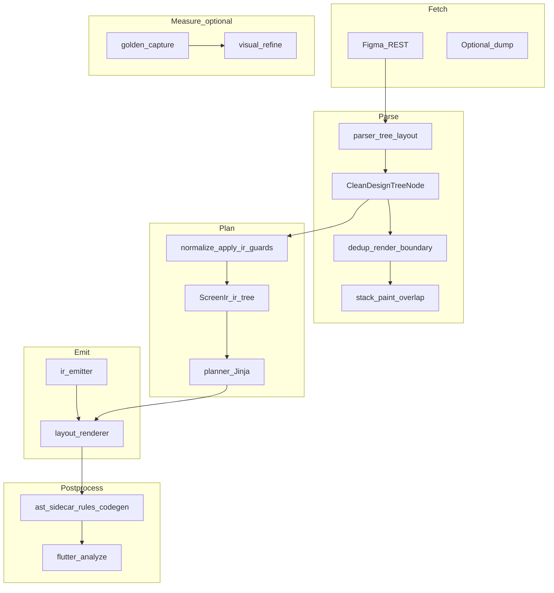
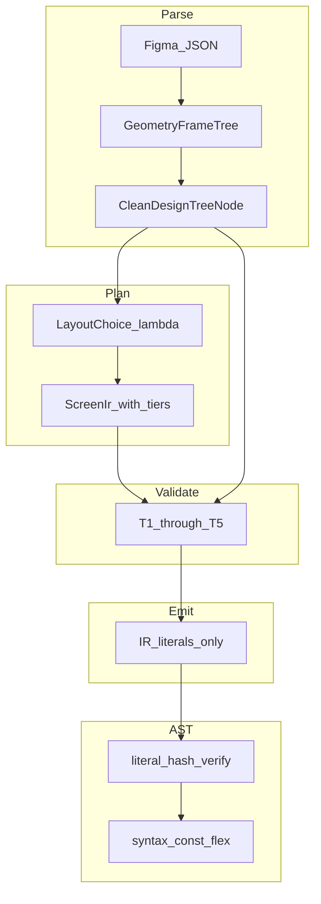

# Universal Translation Theory

**figma-flutter-agent — architectural deep review for pixel-perfect Figma → Flutter compilation**

| Field | Value |
|-------|--------|
| Status | Analytical deliverable (read-only review) |
| Audience | CTO, lead architects, compiler maintainers |
| Scope | Core geometry, typography, IR validation, emit, AST postprocess |
| Out of scope | Screen-specific patches, widget implementations, external repo comparisons |

---

## 1. Executive summary

**figma-flutter-agent** is an AOT compiler: Figma REST JSON → Python parse/normalize → `CleanDesignTreeNode` / `ScreenIr` → Dart emit → native AST sidecar → Flutter layout engine.

**Main algorithmic weakness:** the pipeline maintains **several independent geometric representations** (flex sizing, stack AABB pins, per-node rotation) without a single **GeometryFrame** or composed affine graph. Numbers are rounded at parse time, then re-interpreted under different layout algebras at emit time. Flutter receives declarations that are locally valid but **not guaranteed to be projections of one global Figma placement**.

**Consequence:** “100% pixel perfect” is **undefined** unless split into:

1. **Geometric fidelity** — axis-aligned bounds vs Figma (`IoU` / `GIoU` / `DIoU` in `validation/geometry_metrics.py`, runtime `figma_keys.json` gate).
2. **Raster fidelity** — per-pixel diff (`validation/pixeldiff.py` `changed_ratio`), used by visual refine (disabled on default deterministic path in `stages/visual_refine.py`).

**Strategic direction:** encode five universal invariants **T1–T5** in `generator/ir_validate.py` (and a future dedicated geometry module), emit only quantized IR literals, narrow AST sidecar to syntax and literal verification. Introduce **GeometryFrameTree** at parse time as the single source of placement truth.

---

## 2. Definitions

### 2.1 GeometryFrame (target concept, not implemented)

For each design-tree node `n`, a **GeometryFrame** is:

\[
G(n) = \big(M_{\text{local}} \in \mathbb{R}^{2 \times 3},\; s_{\text{intrinsic}} \in \mathbb{R}^2_{+},\; \lambda(n) \in \{\text{FLEX}, \text{STACK}, \text{RASTER}\}\big)
\]

- \(M_{\text{local}}\): Figma `relativeTransform` (2×3 affine).
- \(M_{\text{global}}(n) = M_{\text{global}}(\text{parent}) \cdot M_{\text{local}}\).
- `stack_placement` and flex `Sizing` are **projections** of \(G(n)\) into parent space, not independently authored fields.

### 2.2 Render tiers

| Tier | When | Emit strategy |
|------|------|----------------|
| **Declarative** | Axis-aligned layout, orthogonal rotation only | `Row` / `Column` / `Stack` + `Positioned` |
| **Vector** | Simple fills, SVG-exportable subtrees | `SvgPicture`, `render_boundary` collapse |
| **Raster** | Skew, non-uniform scale, heavy effects | Exported PNG/SVG + `DecorationImage` / filtered layers |

Tier selection is a **compile-time graph cut**, not a per-screen `if`.

### 2.3 Fidelity metrics

| Metric | Module | Meaning |
|--------|--------|---------|
| `iou`, `giou`, `diou` | `validation/geometry_metrics.py` | Box agreement (Figma AABB vs runtime bounds) |
| `changed_ratio` | `validation/pixeldiff.py` | Fraction of pixels differing (raster) |
| Role thresholds | `GeometryTierThresholds` | Minimum GIoU by `NodeType` (canvas, text, control, …) |

**Contract:** a build is “pixel perfect” only when both geometric gates (per-node tier) and raster gate (optional, τ) pass on reference fixtures.

---

## 3. As-Is pipeline map



### 3.1 Module responsibility matrix

| Concern | Primary modules | Notes |
|---------|-----------------|-------|
| **Coordinate extraction** | `parser/layout.py` | `extract_stack_placement`, `extract_layout_position`, `promote_flex_hosts_with_absolute_children` |
| **Quantization** | `parser/numeric_rounding.py` | 1 dp geometry, 2 dp micro-styles; FID-17 pin closure on stack |
| **Flex → Flutter law** | `generator/layout_flex_policy.py` | `resolve_flex_wrap`, `resolve_cross_axis_alignment`, `relax_row_cross_stretch_when_unbounded` |
| **Dart widget strings** | `generator/layout_widget.py`, `layout_renderer.py` | `_apply_node_transform`, `Positioned`, text strut |
| **Line height / baseline proxy** | `parser/text_line_height.py`, `parser/tree.py`, `generator/layout_style.py` | `resolve_line_height`, `glyph_top_offset` from render vs bbox |
| **Affine parse (local only)** | `parser/geometry.py` | `TransformContext`, `transform_context_from_figma_node` — **not** full graph |
| **Semantic classification** | `parser/geometry.py` | `social_auth_row_confidence`, `auth_button_confidence` — bbox-only, not coordinates |
| **Z-order / overlap** | `parser/overlap_sweep.py`, `parser/stack_paint.py` | Sweep-line AABB overlap; viewport-ratio bottom-nav heuristics |
| **Static paint collapse** | `parser/render_boundary.py` | Vector-heavy subtrees → single SVG/raster leaf |
| **IR merge / index** | `generator/ir_tree.py` | `index_clean_tree`, `merge_screen_ir`, `default_screen_ir` |
| **IR validation / guards** | `generator/ir_validate.py` | Stack bounds, flex scroll slots, ghost occlusion, keyboard scroll, token snap |
| **IR emit** | `generator/ir_emitter.py` | Delegates to `render_node_body` — **same** backend as deterministic |
| **AST postprocess** | `tools/dart_ast_sidecar/lib/rules_codegen.dart` | Unscale, viewport strip, flex wrap, syntax repairs |
| **Geometry scoring** | `validation/geometry_metrics.py` | IoU family for gates |
| **Raster scoring** | `validation/pixeldiff.py` | `changed_ratio` |

### 3.2 Dual paths (deterministic vs IR)

- **Deterministic:** `use_deterministic_screen: true` (default) → `layout_renderer` directly from `CleanDesignTreeNode`.
- **IR / LLM:** `ScreenIr` + `ir_emitter.emit_widget_expression` → still calls `render_node_body` for non-`EXTRACTED` nodes.

After `apply_ir_guards` / `validate_screen_ir`, both paths should share the same guarded tree (`generator/normalize.py`, `generator/planner.py`). **Gap:** guard application is config-dependent (`apply_render_safety_guards`, `unified_canonicalizer`); not all runs normalize before emit.

### 3.3 AST sidecar rule chain (As-Is)

`applyCodegenPass` in `tools/dart_ast_sidecar/lib/rules_codegen.dart` runs, in order:

1. Unicode / string literal normalization  
2. Import sanitization (`ensureAppColorsImport`, `ensureAppLayoutImport`)  
3. `unscaleDesignExpressions`, strip `LayoutBuilder` viewport scale, strip viewport `Transform` hack  
4. LLM API mistake fixes, gesture matryoshka strip  
5. `wrapFlexRowColumnChildren`  
6. `applyLlmSyntaxRepairs`  
7. Optional `ensureTextScalerSupport`  

**Observation:** steps 3–6 repair **layout constraint violations** that ideally fail at IR validate time. This is consistent with `universal-codegen.mdc` only as a **safety net**, not as the primary geometry authority.

---

## 4. Fundamental diagnosis

### 4.1 Primary weakness: no unified GeometryFrame

The compiler stores geometry in **parallel channels**:

| Channel | Schema | Origin |
|---------|--------|--------|
| Flex | `Sizing`, `SizingMode`, `alignment` | Figma auto-layout |
| Absolute | `StackPlacement` | Difference of `absoluteBoundingBox` vs parent (`layout.py`) |
| Rotation | `node.rotation` + local `Transform` emit | `rotation` field or `relativeTransform` (`geometry.py`) |
| Paint order | Sibling list order after heuristics | `stack_paint.py`, `overlap_sweep.py` |

These channels are synchronized by **ad hoc reconcilers** (`reconcile_stack_placement_top_from_edges`, `promote_flex_hosts_with_absolute_children`, `clamp_stack_child_placement_to_parent`) rather than by one transform composition.

**Failure mode:** child appears correct in Figma global view but wrong in Flutter because flex channel and stack channel disagree by 0.5–1.0 dp after independent rounding.

### 4.2 Impedance mismatch (Figma plane vs Flutter constraints)

| Figma | Flutter |
|-------|---------|
| Global artboard, absolute AABB per node | Parent passes `BoxConstraints` |
| Optional affine on any node | `Transform` on widget; `Stack` children use **axis-aligned** `Positioned` only |
| Auto-layout + absolute children mixed | `Row`/`Column` + promoted `STACK` (`promote_flex_hosts_with_absolute_children`) |
| Z-ordered overlapping siblings | `Stack` paint order = child list order |

**Mathematical gap:** Figma placement is a **partial order on overlapping regions in \(\mathbb{R}^2\)** under true shape geometry; Flutter stack uses **total order on children** with AABB proxies. Rotated nodes have AABB larger than visible ink — overlap detection without OBB inflates false overlaps.

`ir_validate._validate_stack_placement_bounds` enforces **bounded** `Positioned` axes — Flutter runtime law, not Figma equivalence.

### 4.3 Typography: bbox-derived metrics, not font tables

Pipeline path:

1. `text_line_height.resolve_line_height` → unitless `TextStyle.height` ratio.  
2. `tree.py` sets `glyph_top_offset = render.y - bbox.y`, `glyph_height` from `absoluteRenderBounds`.  
3. `layout_style.strut_style_expr` → `StrutStyle` + `leadingDistribution.proportional` in emit.

**Gap:** Figma’s line box and Flutter’s `TextPainter` use different font metrics sources. Without a **font-metrics calibration step** (measure ascender/descender per bundled family on target engine), T3 (baseline lock) remains approximate.

### 4.4 AST as corrector, not truth

Large generated `*_layout.dart` files may skip full-file AST when over size limit; chunked pass by `ValueKey('figma-…')` (`tools/ast_sidecar.py`). Rules then fix flex/unscale **after** literals are baked.

**Target:** IR carries final numeric literals; AST verifies equality and applies syntax-only transforms.

### 4.5 Render boundaries vs layer theory

- `render_boundary.py`: collapses dense vector subtrees to one asset (tier **Vector/Raster**).  
- `overlap_sweep.demote_overlapping_occluders`: swaps sibling order when AABB overlap + interactive/occluder types.  
- `ir_validate.validate_stack_ghost_occlusion`: fail-closed if opaque decor is **later** in list and overlaps interactive bounds.

**Missing:** explicit partition into **StaticPaint** (cacheable, `RepaintBoundary`), **Interactive**, **Scroll** subgraphs with proven paint order DAG (T5).

### 4.6 Measurement path asymmetry

- Default **deterministic** pipeline: `visual_refine` returns early when `use_deterministic_screen` (`stages/visual_refine.py`).  
- Geometric runtime gate uses `figma_keys.json` from golden harness (`validation/runtime_geometry.py`).  

Pixel-perfect closure requires **declaring which gate is mandatory** per release profile.

---

## 5. Theorems T1–T5 (core invariants)

Each theorem states: **assumption → predicate → action** on validate failure.

### T1 — Pin closure after quantization (Stack)

**Context:** Parent stack of width \(W\) and height \(H\); child with pins \((l, t, w, h, r, b)\).

**Predicate (horizontal):**

\[
\text{round}(l) + \text{round}(w) + \text{round}(r) = \text{round}(W)
\]

**Vertical:** \(\text{round}(t) + \text{round}(h) + \text{round}(b) = \text{round}(H)\) when all three terms defined.

**As-Is:** `round_stack_placement(..., parent_width=, parent_height=)` in `numeric_rounding.py` (FID-17) adjusts `width`/`height` from parent minus edges.

**Gap:** Emit path does not re-check T1 before writing `Positioned`; flex siblings never get T1.

**Validate pseudocode:**

```text
for each node n with stack_placement p and parent P:
  if p has left, right, width and P.width known:
    assert round(p.left) + round(p.width) + round(p.right) == round(P.width)
  similarly for vertical
  on fail: adjust width OR height as single slack variable OR reject IR
```

**Emit rule:** No second `round()` in templates; literals must equal IR-stored values.

---

### T2 — Flex admissibility (constraints down)

**Context:** Child \(n\) under `Row` or `Column` parent \(P\).

**Predicate:**

\[
\text{CrossStretch}(n) \Rightarrow \text{FiniteCrossExtent}(n, P)
\]

**As-Is:**

- `layout_flex_policy.resolve_cross_axis_alignment` downgrades `stretch` when cross axis unbounded.  
- `relax_row_cross_stretch_when_unbounded` patches emitted `Row(...)`.  
- `ir_validate._validate_flex_child_slot` blocks scroll hosts without `Expanded`/`Flexible`/fixed size.

**Gap:** Deterministic emit may still produce stretch before AST `wrapFlexRowColumnChildren` fixes it.

**Validate pseudocode:**

```text
if parent.type in {ROW, COLUMN} and emitted_cross == stretch:
  require parent bounded on cross axis OR child has fixed cross size OR flex wrap in {EXPANDED, FLEXIBLE_LOOSE}
```

---

### T3 — Baseline lock (typography)

**Context:** Text node with font size \(f\), line height ratio \(\rho\) from `resolve_line_height`, glyph offset \(a\) = `glyph_top_offset`, line box height \(h_{\text{lh}}\) from `glyph_height` or \(f \cdot \rho\).

**Compensatory top inset (conceptual):**

\[
p_t = \alpha(f_{\text{family}}) \cdot a + \beta(f_{\text{family}}) \cdot \max(0,\; h_{\text{lh}} - f \cdot \rho)
\]

\(\alpha, \beta\): per **font family** calibration constants from offline measurement (not per screen).

**As-Is:** `should_emit_strut_style` + `strut_style_expr` (FID-42) partially pin line box; `layout_widget` centers stroke-expanded text using glyph metrics.

**Gap:** No calibration table; no validate warning when `glyph_top_offset` missing on multi-line styles.

**Validate pseudocode:**

```text
if node.type == TEXT and style.font_size > 0:
  if should_emit_strut_style(style):
    require style.line_height or style.glyph_top_offset
  else:
    warn UNBOUNDED_TEXT_METRICS (optional strict mode → fail)
```

**Emit concept:** wrapper padding \(p_t, p_b\) derived from T3 — structural in IR as `textInsets`, not hand-written widget code in this doc.

---

### T4 — Affine cascade (transforms)

**Context:** Node \(i\) with local 2×3 matrix \(M_i\) from `transform_context_from_figma_node`.

**Composition:**

\[
M_{\text{global}}(i) = M_{\text{global}}(\text{parent}(i)) \cdot M_i
\]

**Classification:**

| \(M_{\text{global}}\) | Tier |
|------------------------|------|
| Translation + uniform scale + rotation | Declarative `Transform` with correct pivot |
| Non-uniform scale or skew | Vector/Raster export |
| Identity | No transform wrapper |

**As-Is:** `_apply_node_transform` in `layout_widget.py` rotates about **child bbox center**; ignores parent chain; uses `node.rotation` degrees only.

**Gap:** Nested rotated groups **cannot** be pixel-perfect under declarative emit.

**Validate pseudocode:**

```text
compute M_global for each node
if not is_axis_aligned(M_global):
  mark node tier RASTER or VECTOR; forbid Positioned-only placement for ink
if is_rotation_only(M_global):
  require pivot == figma_transform_origin projected to parent space (not always bbox center)
```

---

### T5 — Paint order DAG (Z-index / hit-test)

**Context:** Siblings \(\{c_1,\ldots,c_k\}\) under stack host with AABB \(R_i\).

**Overlap graph:** edge \((i,j)\) if \(\text{area}(R_i \cap R_j) > \epsilon\).

**Valid paint order** \(\pi\) (lower index = painted first = farther back):

1. If \((i,j) \in E\), \(j\) interactive, \(i\) decorative opaque → \(\pi(i) < \pi(j)\).  
2. Transitive closure of overlap + type rules.  
3. If no topological sort exists → `GenerationError` (ambiguous overlap).

**As-Is:**

- `demote_overlapping_occluders` — local swap heuristic.  
- `stack_paint.sort_absolute_stack_children` — viewport-ratio bottom nav + large backdrop area 20% rule.  
- `validate_stack_ghost_occlusion` — pairwise check interactive under later occluder.

**Gap:** Viewport ratios (e.g. `680/896`) are **not universal**; T5 replaces them with geometry-only DAG.

**Validate pseudocode:**

```text
build overlap graph on stack children AABBs
assign layer STATIC | INTERACTIVE | SCROLL from NodeType + interaction hints
topological_sort with constraints decorative < interactive
if sort fails: error
else: persist child order in IR (paintOrder field)
```

**RepaintBoundary theory (concept):** StaticPaint subtrees that are fully opaque and non-interactive may be wrapped in `RepaintBoundary` + cached raster — **emit policy**, keyed by `render_boundary` collapse ids.

---

## 6. Impedance mismatch — deep dive

### 6.1 From AABB to Flex or Stack

Figma auto-layout solves flex-like distribution in design tool space. Compiler maps:

- `layoutMode` HORIZONTAL/VERTICAL → `ROW`/`COLUMN`  
- `layoutPositioning: ABSOLUTE` → `stack_placement` + host promotion to `STACK`

**Cut problem:** Choose \(\lambda(n) \in \{\text{FLEX}, \text{STACK}\}\) minimizing constraint violations and \(| \text{Positioned nodes} |\) subject to visual IoU \(\geq \tau\) on golden fixtures.

**Current heuristic:** structural rules in `layout.py` + `ir_validate` — not global optimization.

### 6.2 Fractional pixels

Figma uses float geometry; Flutter logical pixels at 1.0 DPR often snap (`snap_device_pixels_scope` in `layout_widget.py` FID-45).

**Theorem linkage:** T1 must be defined on **device-snapped** or **logical** space consistently — one global policy in `numeric_rounding.py`, not snap only at emit.

### 6.3 Hidden third coordinate system: IR vs clean tree

`merge_screen_ir` can attach `WidgetIrOverrides` and `flexWrap` distinct from clean-tree `Sizing`. Guards realign children (`realign_screen_ir_children_to_clean_tree`) but ordering bugs remain a risk.

**Rule:** After merge, \(\forall id: \text{placement}(clean(id)) \equiv \text{placement}(\text{IR projection}(id))\).

---

## 7. Typography and baseline

### 7.1 Figma vs Flutter model

| Aspect | Figma | Flutter emit |
|--------|-------|--------------|
| Line spacing | `lineHeightPx`, percent, AUTO | `TextStyle.height` × `leadingDistribution.proportional` |
| Glyph box | `absoluteRenderBounds` vs `absoluteBoundingBox` | `StrutStyle`, `glyph_top_offset` as `leading` |
| Alignment | `textAlignHorizontal` | `TextAlign` + parent `Align` |

### 7.2 Error budget

Without font-metrics sidecar, expect **vertical drift** on text-heavy screens:

- Typical: 1–4 logical px per text block from metrics mismatch.  
- Mitigation path: T3 calibration + mandatory strut when `glyph_height / font_size > 1.45` (see `layout_widget` stroke detection pattern).

### 7.3 Rich text

`characterStyleOverrides` and mixed styles are a separate subspace — T3 applies per span; validate each span independently.

---

## 8. Transforms and rotation

### 8.1 Local parse (`geometry.py`)

```text
relativeTransform = [[a, c, tx], [b, d, ty]]
rotation_rad = atan2(b, a)
scale_x = hypot(a, b), scale_y = hypot(c, d)
```

Skew appears as non-orthogonal \((a,b,c,d)\) — must trigger tier Raster, not Euler angle alone.

### 8.2 Current emit (`layout_widget._apply_node_transform`)

- Pivot at bbox center when width/height known.  
- Else `Transform.rotate(alignment: Alignment.center)`.  
- **No** \(M_{\text{parent}}\) multiplication.

### 8.3 Target cascade

Maintain stack of transforms during parse DFS; store \(M_{\text{global}}\) on each node in GeometryFrame; emit tier decision from T4.

---

## 9. Paint order and layers

### 9.1 Overlap sweep (`overlap_sweep.py`)

- `sweep_overlapping_pairs`: \(O(n \log n)\) on AABB.  
- `demote_overlapping_occluders`: bubble-style swap until stable.

### 9.2 Stack paint (`stack_paint.py`)

- Infers viewport from max child extents (defaults 414×896).  
- Bottom-nav detection via **viewport height ratios** — replace with T5 DAG.  
- Root backdrop: vectors/images ≥ 20% total area → paint first.

### 9.3 Ghost occlusion validate

`validate_stack_ghost_occlusion`: for each interactive child, later siblings that are opaque occluders with overlapping bounds → error.

**Extension:** generalize to T5 full sort existence check.

### 9.4 Render boundary

Collapses subtrees with ≥6 children, ≥4 vectors, area ≥8000 px² (see `render_boundary.py` constants) when visual-only — maps to **StaticPaint** tier with exported SVG.

---

## 10. Target architecture



**Layout choice:** heuristic scorer + fixture-tuned weights; NP-hard in general — document as approximation, not optimality proof.

---

## 11. Stage refactor playbook

| Stage | Today | Target change |
|-------|--------|----------------|
| **Fetch** | `stages/fetch.py`, `figma/connector.py` | Persist raw `relativeTransform` per node in dump (optional) |
| **Parse** | `tree.py`, `layout.py` | **New:** build `GeometryFrameTree`; project to `stack_placement` / `Sizing` |
| **Normalize** | `dedup.py`, `render_boundary.py`, `stack_paint.py` | T5 sort replaces ratio heuristics; `render_boundary` tags StaticPaint |
| **Plan** | `planner.py`, `normalize.py` | Always `apply_ir_guards` when `apply_render_safety_guards`; unified canonicalizer default on |
| **IR** | `ir_tree.py`, `ir_emitter.py` | Add `layout_tier`, `paint_order`, `text_insets`; emit literals from IR only |
| **Validate** | `ir_validate.py` | Central T1–T5 module; `validate_render_safety` ⊆ T5 |
| **Emit** | `layout_renderer.py`, `layout_widget.py` | Remove duplicate rounding; T4 tier routing |
| **AST** | `rules_codegen.dart` | Shrink geometry rules; add `verifyLiteralsMatchIr` |
| **Measure** | `geometry_metrics.py`, `pixeldiff.py`, golden | Dual gate profile in config; enable refine policy for deterministic when strict PP required |

### 11.1 Recommended implementation order

1. **T1 + T2** in `ir_validate.py` — low risk, high ROI, reduces AST flex fixes.  
2. **T5** — replace `stack_paint` viewport ratios with overlap DAG + topological sort.  
3. **T4** — GeometryFrame + global matrix (medium risk).  
4. **T3** — font-metrics calibration pipeline (high cost, text-heavy UIs).  
5. **AST literal verify** — idempotent hash of numeric literals vs IR export JSON.

### 11.2 Config / product surfaces

| Flag (conceptual) | Effect |
|-------------------|--------|
| `geometry.strict_invariants` | Fail-closed on T1–T5 |
| `fidelity.require_raster_gate` | Run pixel diff on CI |
| `fidelity.require_geometric_gate` | GIoU per `GeometryTierThresholds` |

---

## 12. `ir_emitter.py` and AST roles (summary)

- **`ir_emitter.emit_widget_expression`:** `render_node_body(clean, …)` then `_apply_ir_wrap` for flex IR overrides — geometry originates in layout renderer, not IR-specific math.  
- **Invariant parity:** deterministic and IR paths must run the same post-parse guard copy before emit.  
- **AST:** syntax, imports, const safety (`rules_syntax_repairs.dart`); geometry unscale should become **no-op** when T1–T2 pass at validate.

---

## 13. Appendix

### 13.1 Figma fields → internal schema (selected)

| Figma JSON | Internal |
|------------|----------|
| `absoluteBoundingBox` | `stack_placement`, `sizing.width/height` |
| `relativeTransform` | `TransformContext` (partial), `rotation` |
| `layoutMode`, `itemSpacing`, `padding*` | `ROW`/`COLUMN`, `Padding`, `alignment` |
| `constraints` | `StackPlacement.horizontal/vertical` |
| `style.lineHeight*` | `NodeStyle.line_height` |
| `absoluteRenderBounds` | `glyph_top_offset`, `glyph_height` |
| `reactions[].action` | `prototype.py` (NODE navigation only today) |

### 13.2 Fixture candidates for invariant proofs

| Fixture | Exercises |
|---------|-----------|
| `tests/fixtures/layouts/sign_up_and_sign_in_layout.json` | Mixed flex + absolute, forms, buttons |
| `tests/fixtures/layouts/reminders_layout.json` | Lists, chips, scroll |
| `tests/fixtures/layouts/music_v2_layout.json` | Dense stack, media chrome |
| `tests/fixtures/layouts/music_v2_ru_dirty_layout.json` | Typography / i18n stress |

**Method:** synthetic clean-tree builders (preferred) + golden geometric gate — no screen-name conditionals in invariant code.

### 13.3 Explicit non-goals (today)

| Capability | Status |
|------------|--------|
| Parent `relativeTransform` cascade emit | Not implemented |
| Figma Variables runtime / `SET_VARIABLE` actions | Tokens only (`parser/tokens.py`) |
| Conditional prototype logic → state machine | Not parsed |
| Webhook-driven CI | Roadmap only |
| Guaranteed 100% raster match on deterministic default | Visual refine off for deterministic |

### 13.4 Related internal docs

- `AGENTS.md` — pipeline overview, IR guardrails table  
- `.cursor/rules/universal-codegen.mdc` — AST-only postprocess law  
- `src/figma_flutter_agent/validation/README.md` — `figma_keys.json` runtime bounds  

---

## 14. Review checklist (completed)

- [x] All four research vectors: impedance, typography, transforms, render boundaries  
- [x] Five theorems T1–T5 with formulas and validate pseudocode  
- [x] Pipeline refactor playbook and implementation order  
- [x] No screen-specific patches or widget implementation proposals  
- [x] Roadmap separated from current code truth  

---

*Document generated as part of the Deep Reasoning Review plan. Implementation of T1–T5 in source code is a separate engineering phase.*
